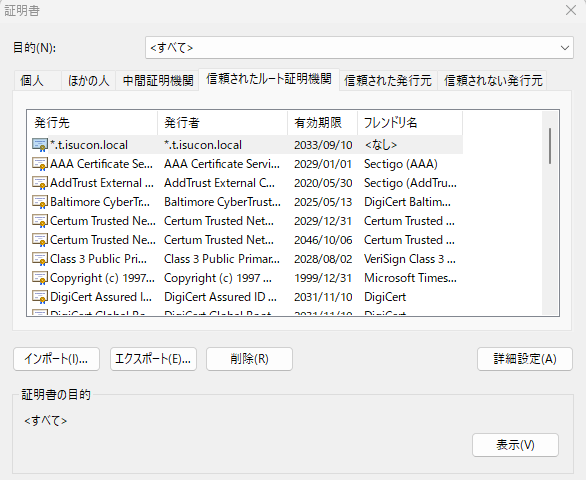

# 行ったこと

ともさんがCA局になってサーバ証明書セットを作成してくださったのでisucon12q1のnginxに設定してみた。  
CA局手順[HERE](20230916_nginx_cert_selfsign.md)  

## 導入したファイル

|ファイル名|説明|導入先|
----|:----:|----
|isucon.crt|サーバ証明書|nginx設定(/etc/nginx内)|
|isucon.key|サーバ秘密鍵|nginx設定(/etc/nginx内)|
|isuconCA.crt|RootCA証明書|ブラウザの証明書ストア|

# サーバ手順  

手元端末からファイルupload
```bash
$ scp -i ~/.ssh/key.pem ~/data/isocon_certs/* ubuntu@isucon12q1:~
```

sshしてサーバ作業。nginx設定を確認して証明書をどこに置くべきか確認。  
```bash
$ less /etc/nginx/nginx.conf
        ##
        # Virtual Host Configs
        ##
        include /etc/nginx/conf.d/*.conf;
        include /etc/nginx/sites-enabled/*;

$ grep ssl sites-enabled/*
sites-enabled/isuports.conf:  ssl_certificate     /etc/nginx/tls/fullchain.pem;
sites-enabled/isuports.conf:  ssl_certificate_key /etc/nginx/tls/key.pem;
```

/etc/nginx/tls/が証明書置き場っぽいので配置。
```bash
$ sudo mv isucon.crt /etc/nginx/tls/
$ sudo mv isucon.key /etc/nginx/tls/
$ ls /etc/nginx/tls
csr.pem      extfile.txt    fullchain.pem.ORIG  isucon.key  key.pem.ORIG
dhparam.pem  fullchain.pem  isucon.crt          key.pem
```

nginxの設定ファイルを修正。（元は`fullchain.pem key.pem`を参照しているので今回uploadしたファイルに差し換え。）
```bash
$ sudo cp isuports.conf isuports.conf.org
$ sudo vi isuports.conf
```
```diff
$ diff isuports.conf isuports.conf.org
7,8c7,8
<   # ssl_certificate     /etc/nginx/tls/fullchain.pem;
<   ssl_certificate     /etc/nginx/tls/isucon.crt;
---
>   ssl_certificate     /etc/nginx/tls/fullchain.pem;
>   ssl_certificate_key /etc/nginx/tls/key.pem;
10,11d9
<   # ssl_certificate_key /etc/nginx/tls/key.pem;
<   ssl_certificate_key /etc/nginx/tls/isucon.key;
```
nginx再起動前にちょっと動作状況を確認。
<details>
<summary>$ service nginx status</summary>
<pre>
● nginx.service - A high performance web server and a reverse proxy server
     Loaded: loaded (/lib/systemd/system/nginx.service; enabled; vendor preset: enabled)
     Active: active (running) since Wed 2023-09-13 07:31:13 UTC; 5h 16min ago
       Docs: man:nginx(8)
    Process: 375 ExecStartPre=/usr/sbin/nginx -t -q -g daemon on; master_process on; (code=exi>
    Process: 486 ExecStart=/usr/sbin/nginx -g daemon on; master_process on; (code=exited, stat>
   Main PID: 541 (nginx)
      Tasks: 3 (limit: 1091)
     Memory: 5.5M
        CPU: 472ms
     CGroup: /system.slice/nginx.service
             ├─541 "nginx: master process /usr/sbin/nginx -g daemon on; master_process on;"
             ├─542 "nginx: worker process" "" "" "" "" "" "" "" "" "" "" "" "" "" "" "" "" "" >
             └─543 "nginx: worker process" "" "" "" "" "" "" "" "" "" "" "" "" "" "" "" "" "" >

Sep 13 07:31:12 ip-172-31-10-204 systemd[1]: Starting A high performance web server and a reve>
Sep 13 07:31:13 ip-172-31-10-204 systemd[1]: Started A high performance web server and a rever>
</pre>
</details>
<details>
<summary>$ curl localhost:443</summary>
<pre>
<html>
<head><title>400 The plain HTTP request was sent to HTTPS port</title></head>
<body>
<center><h1>400 Bad Request</h1></center>
<center>The plain HTTP request was sent to HTTPS port</center>
<hr><center>nginx/1.18.0 (Ubuntu)</center>
</body>
</html>
</pre>
</details>

nginxを再起動して設定を反映
```bash
$ service nginx restart
```
再起動後も同じ様な動作状況だったので大きな問題なし。サーバ作業完了。

# ブラウザ手順  

## RootCA証明書導入（Edgeの場合） 
手順は[ここ](https://jp.globalsign.com/support/clientcert/manual-browser/pkcs12-import-msedge.html)とか参照。 
今回の証明は中間局でなくRootCA証明なので「信頼されたルート証明書機関」に導入する。  
（ハマりました。所謂ルート証明書ストアです。社用PCや自分の管理にないPCに導入しないこと。）  
導入すると下記の様な感じ。



## hosts設定
isucon12予選当日マニュアルに沿って[hosts設定](https://gist.github.com/mackee/4320c18919c8f6f1867849378a17e651#%E3%82%A2%E3%83%97%E3%83%AA%E3%82%B1%E3%83%BC%E3%82%B7%E3%83%A7%E3%83%B3%E3%81%AE%E5%8B%95%E4%BD%9C%E7%A2%BA%E8%AA%8D)を行う。（Windowsの場合は以下の感じ）
```
C:\Windows\System32\drivers\etc\hosts
# localhost name resolution is handled within DNS itself.
#	127.0.0.1       localhost
#	::1             localhost
18.179.10.225 admin.t.isucon.dev
18.179.10.225 isucon.t.isucon.dev
18.179.10.225 kayac.t.isucon.dev
```

## サーバ接続
ブラウザにhostsに記載された名前を入れて繋ぐと正しくIPアドレスにResolveされて接続できます。  
サーバ証明書も真正と認識してくれました。  

