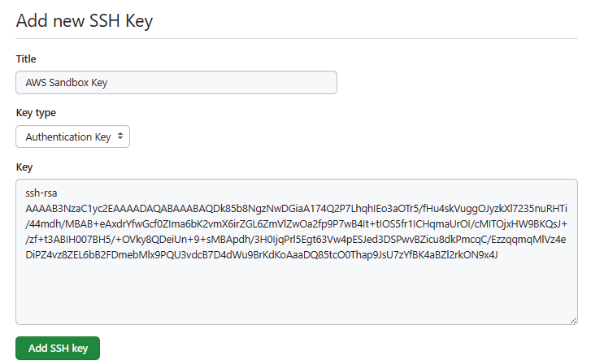
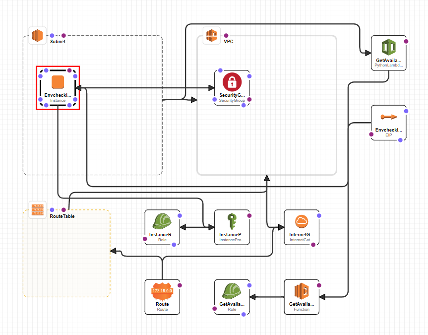
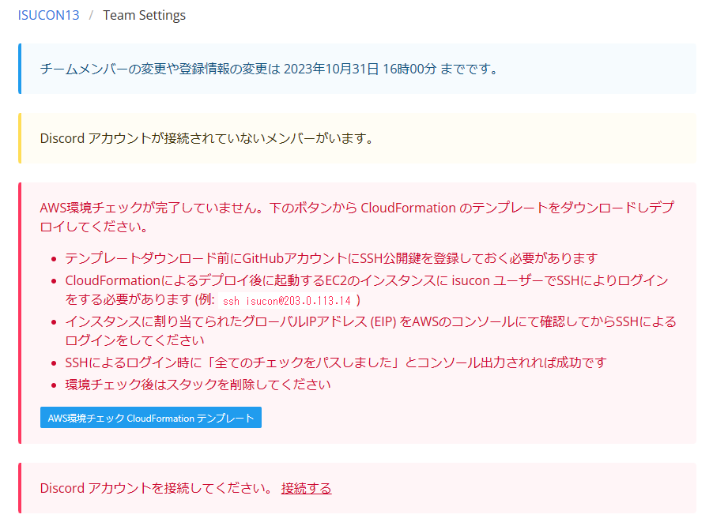
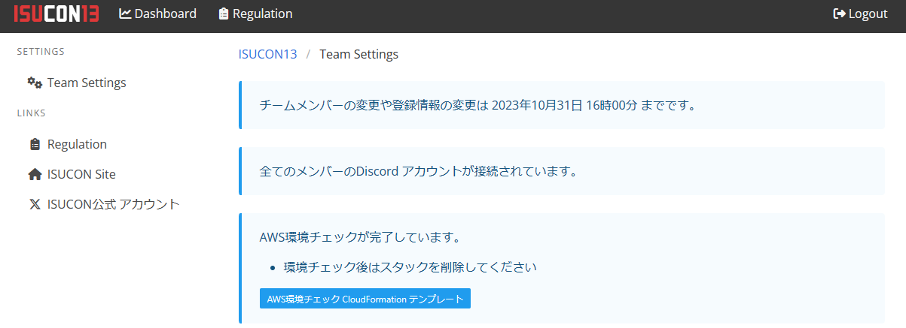
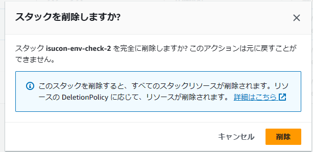

# ISUCON参加条件クリア（AWS環境チェック）

運営の指示に従い下記の参加条件をクリアする

- チームメンバー全員がISUCON13 のサポート用Discordに参加している  
- チームのAWS環境チェックが完了している  

## Discordに参加  
連絡用のDiscordに参加する。GitHubにログインした状態で[ISUCON13 Portal](https://portal.isucon.net/auth/settings/team/)
へアクセスすると「Discordアカウントに接続してください。」という表示があるのでDiscordに遷移しログイン。一度ログインすると警告は消えるので全員ログインを済ます。　　

## AWS環境チェック
### ssh公開鍵設定  

[参考:GitHubでssh接続する手順](https://qiita.com/shizuma/items/2b2f873a0034839e47ce)
- 必要に応じssh公開鍵を生成する。（git hubのssh鍵=EC2接続用ssh鍵） 
- githubの自アカウントにアクセス --> 右上アイコンのメニューからsetting
- サイドバーの [アクセス] セクションで、 [ SSH キーと GPG キー] をクリックします。
- [New SSH key](新しい SSH キー) 
- [キー] フィールドに公開キーを貼り付けます。
- [Add SSH key](SSH キーの追加) をクリックします。  
- githubのURL.keysで確認できる。https://github.com/HideakiTakechi.keys  


### CloudFormationのテンプレートをダウンロード

[ISUCON13 Portal](https://portal.isucon.net/auth/settings/team/)
で「AWS環境チェックCloudFormationダウンロード」を押して
`cloudformation_envcheck.yaml`をダウンロードする。  
（このテンプレートにはチームメンバー全員のgithub登録済みssh公開鍵が含まれる。）  

<details>
<summary>cloudformation_envcheck.yaml</summary>
<pre>
AWSTemplateFormatVersion: 2010-09-09
Description: >-
  AWS CloudFormation for ISUCON13 Environment Checks
Resources:
  GetAvailabilityZoneFunctionExecutionRole:
    Type: AWS::IAM::Role
    Properties:
      AssumeRolePolicyDocument:
        Version: 2012-10-17
        Statement:
          - Effect: Allow
            Principal:
              Service:
                - lambda.amazonaws.com
            Action:
              - sts:AssumeRole
      Path: "/"
      Policies:
        - PolicyName: GetAvailabilityZoneFunctionPolicy
          PolicyDocument:
            Version: 2012-10-17
            Statement:
              - Effect: Allow
                Action:
                  - ec2:DescribeAvailabilityZones
                Resource: "*"
  GetAvailabilityZoneFunction:
    Type: AWS::Lambda::Function
    Properties:
      Code:
        ZipFile: |
          import cfnresponse
          import boto3
          def handler(event, context):
            if event['RequestType'] == "Create":
              ec2 = boto3.client('ec2')
              response = ec2.describe_availability_zones(
                ZoneIds = ['apne1-az1']
              )
              ZoneName = response['AvailabilityZones'][0]['ZoneName']
              cfnresponse.send(event, context, cfnresponse.SUCCESS, {"ZoneName" : ZoneName})
            elif event['RequestType'] == "Update":
              cfnresponse.send(event, context, cfnresponse.SUCCESS, {})
            elif event['RequestType'] == "Delete":
              cfnresponse.send(event, context, cfnresponse.SUCCESS, {})
      Handler: index.handler
      Runtime: python3.8
      Timeout: 30
      Role: !GetAtt GetAvailabilityZoneFunctionExecutionRole.Arn
  GetAvailabilityZone:
    Type: Custom::PythonLambdaExecution
    Properties:
      ServiceToken: !GetAtt GetAvailabilityZoneFunction.Arn

  VPC:
    Type: AWS::EC2::VPC
    Properties:
      CidrBlock: "192.168.0.0/16"
      EnableDnsSupport: "true"
      EnableDnsHostnames: "true"
      InstanceTenancy: default
  InternetGateway:
    Type: AWS::EC2::InternetGateway
  InternetGatewayAttachment:
    Type: AWS::EC2::VPCGatewayAttachment
    Properties:
      InternetGatewayId: !Ref InternetGateway
      VpcId: !Ref VPC
  Subnet:
    Type: AWS::EC2::Subnet
    Properties:
      AvailabilityZone: !GetAtt GetAvailabilityZone.ZoneName
      CidrBlock: "192.168.0.0/24"
      VpcId: !Ref VPC
      MapPublicIpOnLaunch: False
  RouteTable:
    Type: AWS::EC2::RouteTable
    Properties:
      VpcId: !Ref VPC
  Route:
    Type: AWS::EC2::Route
    Properties:
      RouteTableId: !Ref RouteTable
      DestinationCidrBlock: "0.0.0.0/0"
      GatewayId: !Ref InternetGateway
  SubnetRouteTableAssociation:
    Type: AWS::EC2::SubnetRouteTableAssociation
    Properties:
      SubnetId: !Ref Subnet
      RouteTableId: !Ref RouteTable
  SecurityGroup:
    Type: AWS::EC2::SecurityGroup
    Properties:
      VpcId: !Ref VPC
      GroupDescription: Enable SSH access via port 22
      SecurityGroupIngress:
        - IpProtocol: tcp
          FromPort: "22"
          ToPort: "22"
          CidrIp: "0.0.0.0/0"

  InstanceRole:
    Type: AWS::IAM::Role
    Properties:
      AssumeRolePolicyDocument:
        Version: 2012-10-17
        Statement:
          - Effect: Allow
            Principal:
              Service:
                - ec2.amazonaws.com
            Action:
              - sts:AssumeRole
      Path: "/"
      Policies:
        - PolicyName: IsuconEC2InstancePolicy
          PolicyDocument:
            Version: 2012-10-17
            Statement:
              - Effect: Allow
                Action:
                  - ec2:DescribeInstances
                  - ec2:DescribeVolumes
                  - ec2:DescribeNetworkInterfaces
                  - ec2:DescribeSecurityGroups
                  - ec2:DescribeAvailabilityZones
                Resource: "*"
  InstanceProfile:
    Type: AWS::IAM::InstanceProfile
    Properties:
      Path: "/"
      Roles:
        - !Ref InstanceRole

  EnvcheckInstance:
    Type: AWS::EC2::Instance
    Properties:
      ImageId: ami-04a7c0e0153437272
      InstanceType: t3.micro
      SecurityGroupIds:
        - !Ref SecurityGroup
      SubnetId: !Ref Subnet
      IamInstanceProfile:
        !Ref InstanceProfile
      BlockDeviceMappings:
        - DeviceName: /dev/sda1
          Ebs:
            VolumeSize: 8
            VolumeType: gp2
      Tags:
        - Key: Name
          Value: isucon13-envcheck
      UserData:
        Fn::Base64: |
          #cloud-config
          write_files:
          - path: /home/isucon/.ssh/authorized_keys
            owner: isucon:isucon
            permissions: '0600'
            encoding: b64
            content: "c3NoLWVkMjU1MTkgQUFBQUMzTnphQzFsWkRJMU5URTVBQUFBSUdlaEY5NnlTMWZWVzUwQjlqSk5QcDNYWGJadDJ1cm16Y053Tm5KSVVpdFoKc3NoLWVkMjU1MTkgQUFBQUMzTnphQzFsWkRJMU5URTVBQUFBSUxmTndxRElOdUt5WXI4dE5SeTFlYXMzME9wMWZEbDJ4TUx2alFWdCtTSFUKc2stc3NoLWVkMjU1MTlAb3BlbnNzaC5jb20gQUFBQUduTnJMWE56YUMxbFpESTFOVEU1UUc5d1pXNXpjMmd1WTI5dEFBQUFJR3ErUVFZRmdDSHEwNzJZMTdvQnM3RGRUdXg2cUI5bGMxV2l1WDdYeWhIL0FBQUFCSE56YURvPQoKc3NoLXJzYSBBQUFBQjNOemFDMXljMkVBQUFBREFRQUJBQUFCQVFENGNXRFVYV0xDaHZqOUNJQUEwV2lWaDJ6TkNxdzdZOHZBeHU1MWpMTlE4NXJ2VDBHbnplMjk3YW5XSThNRGJJM1hwZHpDdjYxdDU0eXV2WjBDTlVLaTZUdFZTSm9tTGd4Z3lWM3pRUjdyR2Z5L3BXR2M2UElUQlFObDFuM3lidjBRK0ZmT1JiSDZyWWpvMU9FbTZ4a1FiSkthMkFhZ1VFTGtuT2ZBTHRDMk91aHcwbGxFbms4b1doK3pGeUEyRmJvZC9nYUI0TU53MnB1TnEyMVluQmFheklDeWFTY2x2R3VvZFFxYVJqckd3UklJNGxyL1VRUHk1MzNtaHZKMDVlZUhkd2hZV2hGOE5UQXhjUWF0Tk5BeERabG9BMjUrY0dZdGRBR0ZaMnN5Qm5YTTZDNmpRdW5Qb3VqUWNaV29FVk5MQkh2ZHlVcklod3dxSVltODhYb2YKCnNzaC1yc2EgQUFBQUIzTnphQzF5YzJFQUFBQURBUUFCQUFBQkFRRGs4NWI4Tmd6TndER2lhQTE3NFEyUDdMaHFoSUVvM2FPVHI1L2ZIdTRza1Z1Z2dPSnl6a1hsNzIzNW51UkhUaS80NG1kaC9NQkFCK2VBeGRyWWZ3R2NmMFpJbWE2Yksydm1YNmlyWkdMNlptVmxad09hMmZwOVA3d0I0SXQrdElPUzVmcjFJQ0hxbWFVck9JL2NNSVRPanhIVzlCS1FzSisvemYrdDNBQklIMDA3Qkg1LytPVmt5OFFEZWlVbis5K3NNQkFwZGgvM0gwSWpxUHJsNUVndDYzVnc0cEVTSmVkM0RTUHd2QlppY3U4ZGtQbWNxQy9FenpxcW1xTWxWejRlRGlQWjR2ejhaRUw2YkIyRkRtZWJNbHg5UFFVM3ZkY0I3RDRkV3U5QnJLZEtvQWFhRFE4NXRjTzBUaGFwOUpzVTd6WWZCSzRhQlpsMnJrT045eDRKCg=="
          - path: /opt/isucon-env-checker/portal_credentials.json
            owner: root:root
            permissions: '0644'
            encoding: b64
            content: "eyJkZXYiOiB0cnVlLCAidG9rZW4iOiAiWFJpZmsmJUcmYWlSWlYzVkNzJEwkNXFAZVQhayoxRndwODVYSl5oWnNeIVljM29lajZUVjdKRnBxOVUxOVNtMiIsICJob3N0IjogInBvcnRhbC5pc3Vjb24ubmV0In0="
  EnvcheckInstanceIP:
    Type: AWS::EC2::EIP
    Properties:
      Domain: vpc
      InstanceId: !Ref EnvcheckInstance

</pre>
</details>

### CloudFormationのスタック作成  
ダウンロードしたテンプレートファイルを元にスタックを作成するとVPCやEC2が作成される。
- AWSログイン > サービス > CloudFormation > スタックの作成  
- テンプレートの準備完了を選ぶ (テンプレートファイルはあるので)
- テンプレートソースは、ファイルのアップロードで行う。
- ここでデザイナーを使うとGUIでサイトの構成をレビューできる。
- スタック名を指定する(isucon-env-check-01など)
- Nameタグを追加しておくと識別しやすい
- 他はデフォルトで問題なし
- IAM作成の承認にチェックしてから「送信」
- CREATE_IN_PROGRESS --> CREATE_COMPLETE を待つ

VPCはサイトあたり最大5個なので不要なVPCは消しておこう。  
何らかのエラーで失敗するとスタックごとロールバックされる。  
下記はデザイナーでテンプレートの内容を表示した様子  


### EC2接続試験
Nameが`isucon13-envcheck`のEC2が作成されて起動される。  
メンバー全員のssh鍵でログインできる。  
このインスタンスは接続成功すると以下の様にメッセージを表示して切断する。
```
$ ssh isucon13test
Last login: Tue Oct  3 13:30:23 2023 from 116.82.244.82
SSH 接続が成功しました
環境をチェックしています...
全てのチェックをパスしました
Connection to 54.92.92.245 closed.
```

## 実施結果の確認

[ISUCON Portal](https://portal.isucon.net/auth/settings/team/) でこれらが完了していることを確認できる(10/13〆切)  

### Before


### After


### 確認後
費用削減にCloudFormationのスタックを削除する。スタックで作成したリソースも削除される。



