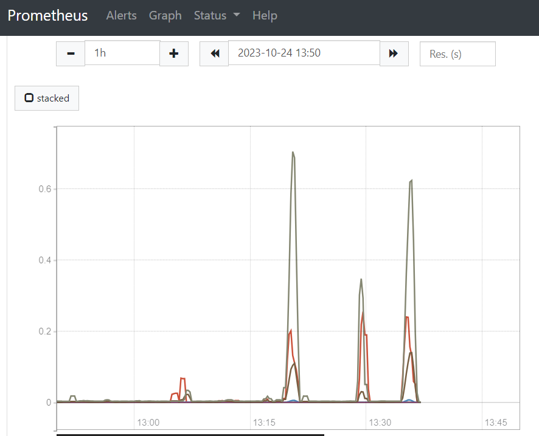

# ISUCON12予選講評を参考にしてみた！
ISUCON公式ブログ「ISUCON12 予選問題の解説と講評」（以降、ブログと記載）を参考に攻略を試みました。
https://isucon.net/archives/56850281.html

上記ブログの中段部分「visit_history の不要行削減」 の節を参考に、以下3点のカラムに対して複合インデックスを設定していきます。

- tenant_id
- competition_id
- player_id

2023.10.5(木)の素振り会では "tenant_id"と"competition_id"で複合インデックスを作成したので、今回は"player_id"を追加する形です。
これによって結果がどう変化するかな～？わくわく！
以下、実際に試行した内容と結果を順番に記載します。

## まずはベンチマーク
我先にとブログで紹介されているクエリを投げようとしたTaka(筆者)を、優しく静止してくれたhidetakeさんに感謝してベンチマークを実施しました。
チューニングの成果を確認するためにベンチマークは大切ですね！

```
isucon@ip-172-31-10-204:~/bench$ ./bench -target-addr 127.0.0.1:443
中略
[ADMIN] 13:20:31.558126 負荷走行を終了しました
[ADMIN] 13:20:32.559202 ScenarioScoreMap: map[string]int64{
  "AdminBilling":                      24,
  "AdminBillingValidate":              252,
  "OrganizerNewTenant":                409,
  "OrganizerPeacefulTenant":           0,
  "OrganizerPopularTenant":            197,
  "OrganizerPopularTenantHeavyTenant": 23,
  "Player":                            783,
  "PlayerHeavyTenant":                 7,
  "PlayerValidate":                    616,
  "TenantBillingValidate":             765,
}
[ADMIN] 13:20:32.559317 WorkerCount: map[string]int{
  "AdminBillingScenarioWorker":   1,
  "AdminBillingValidateWorker":   1,
  "NewTenantScenarioWorker":      2,
  "PlayerScenarioWorker":         83,
  "PlayerValidateScenarioWorker": 1,
  "PopularTenantScenarioWorker":  2,
  "TenantBillingValidateWorker":  1,
}
13:20:32.559335 Error 0 (Critical:0)
13:20:32.559337 PASSED: true
13:20:32.559341 SCORE: 3076 (+3076 0(0%))
[ADMIN] 13:20:32.559502 score.ScoreTable{
  "GET /api/admin/tenants/billing":                         23,
  "GET /api/organizer/billing":                             21,
  "GET /api/organizer/players/list":                        31,
  "GET /api/player/competition/:competition_id/ranking":    709,
  "GET /api/player/competitions":                           134,
  "GET /api/player/player/:player_name":                    568,
  "POST /api/admin/tenants/add":                            3,
  "POST /api/organizer/competition/:competition_id/finish": 37,
  "POST /api/organizer/competition/:competition_id/score":  50,
  "POST /api/organizer/competitions/add":                   43,
  "POST /api/organizer/player/:player_name/disqualified":   11,
  "POST /api/organizer/players/add":                        6,
}
```

この時の"dstat"結果はこちら↓
```
isucon@ip-172-31-10-204:~$ dstat
You did not select any stats, using -cdngy by default.
--total-cpu-usage-- -dsk/total- -net/total- ---paging-- ---system--
usr sys idl wai stl| read  writ| recv  send|  in   out | int   csw
  1   0  99   0   0| 740k  570k|   0     0 |   0     0 | 481   972
 20   9  20  50   1| 664k   51M|  92B 1148B|   0     0 |  15k   37k
 10   7  21  62   0| 176k   60M|  92B 4796B|   0     0 |  14k   29k
  7   5  36  52   0| 256k   45M| 122B  506B|   0     0 |8940    18k
 57  12  13  17   0|1928k   28M|  46B  338B|   0     0 |9941    25k
 72  10   4  14   0|5784k   24M| 184B 7430B|   0     0 |  11k   27k
 64  12   5  19   0|6816k   42M| 168B  758B|   0     0 |  11k   26k
 65   8   3  25   0|8384k   55M|  46B  338B|   0     0 |  13k   29k
 80  14   1   5   0|5616k   38M|  92B 4474B|   0     0 |  11k   28k
 85  14   0   1   0|2528k   41M|  46B  338B|   0     0 |9790    24k
 91   9   1   0   0|4896k   14M|  46B  338B|   0     0 |8871    24k
 90   9   1   1   0|3424k   22M| 288B 7980B|   0     0 |7690    20k
 91   8   0   0   0|4608k   19M| 198B  674B|   0     0 |9126    24k
 93   7   0   0   0|2848k   21M|  46B  338B|   0     0 |7656    19k
 73  15   1  11   0|4392k   56M|  92B 4442B|   0     0 |  13k   33k
 73  13   1  13   0|4376k   41M|  46B  338B|   0     0 |  10k   27k
```
何やらせっせとディスクにwriteしているご様子。

## 複合インデックス作成
MYSOLのコマンドを叩くのは初めての筆者。
何事も初めての時は、ドキドキ・わくわくしますね～！
```
isucon@ip-172-31-10-204:~/webapp$ mysql -u isucon -p
Enter password:
Welcome to the MySQL monitor.  Commands end with ; or \g.
Your MySQL connection id is 11
Server version: 8.0.34-0ubuntu0.22.04.1 (Ubuntu)
略
mysql> 
```

初心者丸出しの筆者は、show databeses; を実行しようとして「;」を入力し忘れました。。
「どうやって復帰すればいいんですか～？」とテンパっているTakaに対して、
Tomoさんが優しく一言「"->"の後に入力すれば大丈夫ですよ。」とご助言を頂き、無事に乗り切りました！
Tomoさんありがとうございました。ChallengClubの皆さんは初心者に対して寛大なのでとても助かります。
```
mysql> show databases
    -> ;
+--------------------+
| Database           |
+--------------------+
| information_schema |
| isuports           |
| performance_schema |
+--------------------+
3 rows in set (0.00 sec)

mysql> use isuports
Reading table information for completion of table and column names
You can turn off this feature to get a quicker startup with -A

Database changed
mysql> show tables;
+--------------------+
| Tables_in_isuports |
+--------------------+
| id_generator       |
| tenant             |
| visit_history      |
+--------------------+
3 rows in set (0.00 sec)

mysql> show create table visit_history;
+---------------+---------------------------------------------------------------------------------------------------------------------------------------------------------------------------------------------------------------------------------------------------------------------------------------------------------------------------------------------------------------------------------------------------+
| Table         | Create Table


                                                                                               |
+---------------+---------------------------------------------------------------------------------------------------------------------------------------------------------------------------------------------------------------------------------------------------------------------------------------------------------------------------------------------------------------------------------------------------+
| visit_history | CREATE TABLE `visit_history` (
  `player_id` varchar(255) NOT NULL,
  `tenant_id` bigint unsigned NOT NULL,
  `competition_id` varchar(255) NOT NULL,
  `created_at` bigint NOT NULL,
  `updated_at` bigint NOT NULL,
  KEY `tenant_id_idx` (`tenant_id`),
  KEY `tenant_id_competition_id_idx` (`tenant_id`,`competition_id`)
) ENGINE=InnoDB DEFAULT CHARSET=utf8mb4 COLLATE=utf8mb4_0900_ai_ci |
+---------------+---------------------------------------------------------------------------------------------------------------------------------------------------------------------------------------------------------------------------------------------------------------------------------------------------------------------------------------------------------------------------------------------------+
1 row in set (0.00 sec)

mysql> select count(*) from visit_history;
+----------+
| count(*) |
+----------+
|  3225652 |
+----------+
1 row in set (0.95 sec)
```

20231005_mysql_slowlog.md を参考にMYSQLのコマンドをおさらいしてから、
いざ複合インデックスを作成します！
```
mysql> ALTER TABLE visit_history ADD INDEX tenant_id_idx_4(tenant_id, competition_id, player_id, created_at);
Query OK, 0 rows affected (35.89 sec)
Records: 0  Duplicates: 0  Warnings: 0
```

４つのカラムから複合インデックスを作成するので、名称は「tenant_id_idx_<span style="color: red; ">4</span>」です。
「単純ですが、わかればいいんです！」と押し切ります。

show create table visit_history; コマンドにて複合インデックスを正しく作成できたことが確認できました。
```
mysql> show create table visit_history;
+---------------+------------------------------------------------------------------------------------------------------------------------------------------------------------------------------------------------------------------------------------------------------------------------------------------------------------------------------------------------------------------------------------------------------------------------------------------------------------------------------------+
| Table         | Create Table
                                                                                                                                                                                                             |
+---------------+------------------------------------------------------------------------------------------------------------------------------------------------------------------------------------------------------------------------------------------------------------------------------------------------------------------------------------------------------------------------------------------------------------------------------------------------------------------------------------+
| visit_history | CREATE TABLE `visit_history` (
  `player_id` varchar(255) NOT NULL,
  `tenant_id` bigint unsigned NOT NULL,
  `competition_id` varchar(255) NOT NULL,
  `created_at` bigint NOT NULL,
  `updated_at` bigint NOT NULL,
  KEY `tenant_id_idx` (`tenant_id`),
  KEY `tenant_id_competition_id_idx` (`tenant_id`,`competition_id`),
  KEY `tenant_id_idx_4` (`tenant_id`,`competition_id`,`player_id`,`created_at`)
) ENGINE=InnoDB DEFAULT CHARSET=utf8mb4 COLLATE=utf8mb4_0900_ai_ci |
+---------------+------------------------------------------------------------------------------------------------------------------------------------------------------------------------------------------------------------------------------------------------------------------------------------------------------------------------------------------------------------------------------------------------------------------------------------------------------------------------------------+
1 row in set (0.00 sec)
```

## ここまでの成果を試すべくベンチマーク
再びbenchを実行します。
```
isucon@ip-172-31-10-204:~/bench$ ./bench -target-addr 127.0.0.1:443
中略
[ADMIN] 13:35:40.146770 負荷走行を終了しました
13:35:41.145420 ERROR[0] validation: load-validation: JSONのdecodeに失敗しました GET /api/player/competition/9fa548de/ranking status 200 tenant:unfv-iknklj-1698154480 role:player playerID:9fa52a11 competitionID:9fa548de rankAfter:
[ADMIN] 13:35:41.145649 ScenarioScoreMap: map[string]int64{
  "AdminBilling":                      30,
  "AdminBillingValidate":              264,
  "OrganizerNewTenant":                525,
  "OrganizerPeacefulTenant":           0,
  "OrganizerPopularTenant":            194,
  "OrganizerPopularTenantHeavyTenant": 29,
  "Player":                            781,
  "PlayerHeavyTenant":                 13,
  "PlayerValidate":                    682,
  "TenantBillingValidate":             1062,
}
[ADMIN] 13:35:41.145772 WorkerCount: map[string]int{
  "AdminBillingScenarioWorker":   1,
  "AdminBillingValidateWorker":   1,
  "NewTenantScenarioWorker":      2,
  "PlayerScenarioWorker":         90,
  "PlayerValidateScenarioWorker": 1,
  "PopularTenantScenarioWorker":  2,
  "TenantBillingValidateWorker":  1,
}
13:35:41.145792 Error 1 (Critical:0)
13:35:41.145794 PASSED: true
13:35:41.145798 SCORE: 3545 (+3580 -35(1%))
[ADMIN] 13:35:41.145993 score.ScoreTable{
  "GET /api/admin/tenants/billing":                         29,
  "GET /api/organizer/billing":                             24,
  "GET /api/organizer/players/list":                        34,
  "GET /api/player/competition/:competition_id/ranking":    1002,
  "GET /api/player/competitions":                           149,
  "GET /api/player/player/:player_name":                    564,
  "POST /api/admin/tenants/add":                            3,
  "POST /api/organizer/competition/:competition_id/finish": 42,
  "POST /api/organizer/competition/:competition_id/score":  57,
  "POST /api/organizer/competitions/add":                   47,
  "POST /api/organizer/player/:player_name/disqualified":   12,
  "POST /api/organizer/players/add":                        6,
}
```

チューニング前よりスコアが500程度アップしました！！！
その時のPrometheusモニタリング結果は以下です。kiwsさんが取得してくれました。感謝！


kiwsさんのコメント転記↓
```
CPU使用率も下がってます。
1個目の山がデフォルトbench、
2個目の山がインデックス張り直し、
3個目の山がbench。
```

<br>しかし、bench結果をよく見ると以下のERROR発生により35点減点されていました。
このERRORに対処できると35点加点できそうです。
が、、、なぜJSONのdecodeに失敗するようになったんですかね？
自分は要因がわからないので、次回深堀りできたら助かります。
```
13:35:41.145420 ERROR[0] validation: load-validation: JSONのdecodeに失敗しました GET /api/player/competition/9fa548de/ranking status 200 tenant:unfv-iknklj-1698154480 role:player playerID:9fa52a11 competitionID:9fa548de rankAfter:
```

<br>"tenant_id"と"competition_id"で複合インデックスを作成した2023.10.5(木)チューニング後のScoreも参考値として以下に示します。 

| チューニング前Score | チューニング後Score | チューニング後Score<br>(参考値)2023.10.05 |
| :--- | :--- | :--- |
| 3076 (+3076 0(0%)) | 3545 (+3580 -35(1%)) | 3084 (+3084 0(0%)) |

<br>この後もブログに沿って作業を進めます。

## created_atの行だけを使った新しいテーブル作成
ブログで紹介されている以下のクエリを投げて新しいテーブルを作成します。
```
CREATE TABLE visit_history_2 AS
SELECT tenant_id, player_id, competition_id, MIN(created_at) AS created_at FROM visit_history GROUP BY tenant_id, player_id, competition_id;
ALTER TABLE visit_history RENAME TO visit_history_old;
ALTER TABLE visit_history_2 RENAME TO visit_history;
CREATE UNIQUE INDEX visit_history_idx ON visit_history(tenant_id, player_id, competition_id);
```

順番にクエリを投げるだけの単純な作業ですが、ここでTakaはある事をやらかします…。
作業時のコンソール入力内容を以下に転記します。
```
mysql> ALTER TABLE visit_history ADD INDEX tenant_id_idx_4(tenant_id, competition_id, player_id, created_at);
Query OK, 0 rows affected (35.89 sec)
Records: 0  Duplicates: 0  Warnings: 0

mysql> show create table visit_history;
+---------------+------------------------------------------------------------------------------------------------------------------------------------------------------------------------------------------------------------------------------------------------------------------------------------------------------------------------------------------------------------------------------------------------------------------------------------------------------------------------------------+
| Table         | Create Table
                                                                                                                                                                                                             |
+---------------+------------------------------------------------------------------------------------------------------------------------------------------------------------------------------------------------------------------------------------------------------------------------------------------------------------------------------------------------------------------------------------------------------------------------------------------------------------------------------------+
| visit_history | CREATE TABLE `visit_history` (
  `player_id` varchar(255) NOT NULL,
  `tenant_id` bigint unsigned NOT NULL,
  `competition_id` varchar(255) NOT NULL,
  `created_at` bigint NOT NULL,
  `updated_at` bigint NOT NULL,
  KEY `tenant_id_idx` (`tenant_id`),
  KEY `tenant_id_competition_id_idx` (`tenant_id`,`competition_id`),
  KEY `tenant_id_idx_4` (`tenant_id`,`competition_id`,`player_id`,`created_at`)
) ENGINE=InnoDB DEFAULT CHARSET=utf8mb4 COLLATE=utf8mb4_0900_ai_ci |
+---------------+------------------------------------------------------------------------------------------------------------------------------------------------------------------------------------------------------------------------------------------------------------------------------------------------------------------------------------------------------------------------------------------------------------------------------------------------------------------------------------+
1 row in set (0.00 sec)

mysql> select count(*) from visit_history;
+----------+
| count(*) |
+----------+
|  3225905 |
+----------+
1 row in set (0.42 sec)

mysql> CREATE TABLE visit_history_2 AS
    -> SELECT tenant_id, player_id, competition_id, MIN(created_at) AS created_at FROM visit_history GROUP BY tenant_id, player_id, competition_id;
Query OK, 201267 rows affected (26.11 sec)
Records: 201267  Duplicates: 0  Warnings: 0

mysql> select count(*) from visit_history;
+----------+
| count(*) |
+----------+
|  3225905 |
+----------+
1 row in set (0.41 sec)

mysql> ALTER TABLE visit_history RENAME TO visit_history_old;
Query OK, 0 rows affected (0.02 sec)

mysql> select count(*) from visit_history_2;
+----------+
| count(*) |
+----------+
|   201267 |
+----------+
1 row in set (0.02 sec)

mysql> ALTER TABLE visit_history_2 RENAME TO visit_history;7
Query OK, 0 rows affected (0.02 sec)

    -> ALTER TABLE visit_history_2 RENAME TO visit_history;
ERROR 1064 (42000): You have an error in your SQL syntax; check the manual that corresponds to your MySQL server version for the right syntax to use near '7
ALTER TABLE visit_history_2 RENAME TO visit_history' at line 1
mysql>

mysql> ALTER TABLE visit_history_2 RENAME TO visit_history;
ERROR 1146 (42S02): Table 'isuports.visit_history_2' doesn't exist
mysql> ALTER TABLE visit_history_2 RENAME TO visit_history;
ERROR 1146 (42S02): Table 'isuports.visit_history_2' doesn't exist
mysql> CREATE UNIQUE INDEX visit_history_idx ON visit_history(tenant_id, player_id, competition_id);
Query OK, 0 rows affected (3.20 sec)
Records: 0  Duplicates: 0  Warnings: 0

mysql>
mysql> select count(*) from visit_history;
+----------+
| count(*) |
+----------+
|   201267 |
+----------+
1 row in set (0.02 sec)

mysql>
```

「3,225,905行」から「201,267行」へ行数削減できているので成功しているように見えるのですが、やらかしています。。

やらかした点に皆さんお気づきでしょうか？
そうです・・・。以下のところでタイプミスをやらかして、不要な「7」を投げています。
mysql> ALTER TABLE visit_history_2 RENAME TO visit_history;<span style="color: red; ">7</span>

これが起因しているのか、この後に実行したベンチマークがエラーで終了してしまいました。。
その時の結果はこんなかんじです↓
```
isucon@ip-172-31-10-204:~/bench$ ./bench -target-addr 127.0.0.1:443
中略
13:47:46.427291 整合性チェックに失敗しました
13:47:47.427443 ERROR[0] prepare: load-validation: GET /api/player/competition/9fa52522/ranking : expected([200]) != actual(500) tenant:pmhn-opvx-1698155263 role:player playerID:9fa52401 competitionID:9fa52522 rankAfter:
13:47:47.427460 ERROR[1] prepare: load-validation: GET /api/player/competition/9fa52405/ranking : expected([200]) != actual(500) tenant:tt-frsyi-1698155263 role:player playerID:9fa52408 competitionID:9fa52405 rankAfter:
[ADMIN] 13:47:47.427607 ScenarioScoreMap: map[string]int64{
  "AdminBilling":            0,
  "AdminBillingValidate":    0,
  "OrganizerNewTenant":      0,
  "OrganizerPeacefulTenant": 0,
  "OrganizerPopularTenant":  0,
  "Player":                  0,
  "PlayerValidate":          0,
  "TenantBillingValidate":   0,
}
[ADMIN] 13:47:47.427671 WorkerCount: map[string]int{}
13:47:47.427684 Error 2 (Critical:0)
13:47:47.427687 PASSED: false
13:47:47.427690 SCORE: 0 (+0 0(2%))
[ADMIN] 13:47:47.427847 score.ScoreTable{
  "GET /api/admin/tenants/billing":                         0,
  "GET /api/organizer/billing":                             0,
  "GET /api/player/competition/:competition_id/ranking":    0,
  "GET /api/player/competitions":                           0,
  "GET /api/player/player/:player_name":                    0,
  "POST /api/admin/tenants/add":                            0,
  "POST /api/organizer/competition/:competition_id/finish": 0,
  "POST /api/organizer/competition/:competition_id/score":  0,
  "POST /api/organizer/competitions/add":                   0,
  "POST /api/organizer/player/:player_name/disqualified":   0,
  "POST /api/organizer/players/add":                        0,
}
```

どうやらデータベースが壊れてしまったようです。。。
「あわわわわわわ・・・(汗) さぁどうしましょう！！！」と再度Takaがテンパっていると
Tomoさんが救いの手を差し伸べてくれました。感謝！

「~/webapp/sql/init.sh でデータベースを初期化できそうです。」
ってことで内容を確認してみます。
```
isucon@ip-172-31-10-204:~/webapp/sql$ cat init.sh
#!/bin/sh

set -ex
cd `dirname $0`

ISUCON_DB_HOST=${ISUCON_DB_HOST:-127.0.0.1}
ISUCON_DB_PORT=${ISUCON_DB_PORT:-3306}
ISUCON_DB_USER=${ISUCON_DB_USER:-isucon}
ISUCON_DB_PASSWORD=${ISUCON_DB_PASSWORD:-isucon}
ISUCON_DB_NAME=${ISUCON_DB_NAME:-isuports}

# MySQLを初期化
mysql -u"$ISUCON_DB_USER" \
                -p"$ISUCON_DB_PASSWORD" \
                --host "$ISUCON_DB_HOST" \
                --port "$ISUCON_DB_PORT" \
                "$ISUCON_DB_NAME" < init.sql

# SQLiteのデータベースを初期化
rm -f ../tenant_db/*.db
cp -r ../../initial_data/*.db ../tenant_db/
```

tenant_dbディレクトリ内のdbファイルを軒並みremoveしてから、初期データベースをcopyしているようです。
早速叩いてみます。
```
isucon@ip-172-31-10-204:~/webapp/sql$ ./init.sh
+ dirname ./init.sh
+ cd .
+ ISUCON_DB_HOST=127.0.0.1
+ ISUCON_DB_PORT=3306
+ ISUCON_DB_USER=isucon
+ ISUCON_DB_PASSWORD=isucon
+ ISUCON_DB_NAME=isuports
+ mysql -uisucon -pisucon --host 127.0.0.1 --port 3306 isuports
mysql: [Warning] Using a password on the command line interface can be insecure.
+ rm -f ../tenant_db/1.db ../tenant_db/10.db ../tenant_db/100.db ../tenant_db/11.db ../tenant_db/12.db ../tenant_db/13.db ../tenant_db/14.db ../tenant_db/15.db ../tenant_db/16.db ../tenant_db/162.db ../tenant_db/163.db ../tenant_db/164.db ../tenant_db/165.db ../tenant_db/17.db ../tenant_db/18.db ../tenant_db/19.db ../tenant_db/2.db ../tenant_db/20.db ../tenant_db/21.db ../tenant_db/22.db ../tenant_db/23.db ../tenant_db/24.db ../tenant_db/25.db ../tenant_db/26.db ../tenant_db/27.db ../tenant_db/28.db ../tenant_db/29.db ../tenant_db/3.db ../tenant_db/30.db ../tenant_db/31.db ../tenant_db/32.db ../tenant_db/33.db ../tenant_db/34.db ../tenant_db/35.db ../tenant_db/36.db ../tenant_db/37.db ../tenant_db/38.db ../tenant_db/39.db ../tenant_db/4.db ../tenant_db/40.db ../tenant_db/41.db ../tenant_db/42.db ../tenant_db/43.db ../tenant_db/44.db ../tenant_db/45.db ../tenant_db/46.db ../tenant_db/47.db ../tenant_db/48.db ../tenant_db/49.db ../tenant_db/5.db ../tenant_db/50.db ../tenant_db/51.db ../tenant_db/52.db ../tenant_db/53.db ../tenant_db/54.db ../tenant_db/55.db ../tenant_db/56.db ../tenant_db/57.db ../tenant_db/58.db ../tenant_db/59.db ../tenant_db/6.db ../tenant_db/60.db ../tenant_db/61.db ../tenant_db/62.db ../tenant_db/63.db ../tenant_db/64.db ../tenant_db/65.db ../tenant_db/66.db ../tenant_db/67.db ../tenant_db/68.db ../tenant_db/69.db ../tenant_db/7.db ../tenant_db/70.db ../tenant_db/71.db ../tenant_db/72.db ../tenant_db/73.db ../tenant_db/74.db ../tenant_db/75.db ../tenant_db/76.db ../tenant_db/77.db ../tenant_db/78.db ../tenant_db/79.db ../tenant_db/8.db ../tenant_db/80.db ../tenant_db/81.db ../tenant_db/82.db ../tenant_db/83.db ../tenant_db/84.db ../tenant_db/85.db ../tenant_db/86.db ../tenant_db/87.db ../tenant_db/88.db ../tenant_db/89.db ../tenant_db/9.db ../tenant_db/90.db ../tenant_db/91.db ../tenant_db/92.db ../tenant_db/93.db ../tenant_db/94.db ../tenant_db/95.db ../tenant_db/96.db ../tenant_db/97.db ../tenant_db/98.db ../tenant_db/99.db
+ cp -r ../../initial_data/1.db ../../initial_data/10.db ../../initial_data/100.db ../../initial_data/11.db ../../initial_data/12.db ../../initial_data/13.db ../../initial_data/14.db ../../initial_data/15.db ../../initial_data/16.db ../../initial_data/17.db ../../initial_data/18.db ../../initial_data/19.db ../../initial_data/2.db ../../initial_data/20.db ../../initial_data/21.db ../../initial_data/22.db ../../initial_data/23.db ../../initial_data/24.db ../../initial_data/25.db ../../initial_data/26.db ../../initial_data/27.db ../../initial_data/28.db ../../initial_data/29.db ../../initial_data/3.db ../../initial_data/30.db ../../initial_data/31.db ../../initial_data/32.db ../../initial_data/33.db ../../initial_data/34.db ../../initial_data/35.db ../../initial_data/36.db ../../initial_data/37.db ../../initial_data/38.db ../../initial_data/39.db ../../initial_data/4.db ../../initial_data/40.db ../../initial_data/41.db ../../initial_data/42.db ../../initial_data/43.db ../../initial_data/44.db ../../initial_data/45.db ../../initial_data/46.db ../../initial_data/47.db ../../initial_data/48.db ../../initial_data/49.db ../../initial_data/5.db ../../initial_data/50.db ../../initial_data/51.db ../../initial_data/52.db ../../initial_data/53.db ../../initial_data/54.db ../../initial_data/55.db ../../initial_data/56.db ../../initial_data/57.db ../../initial_data/58.db ../../initial_data/59.db ../../initial_data/6.db ../../initial_data/60.db ../../initial_data/61.db ../../initial_data/62.db ../../initial_data/63.db ../../initial_data/64.db ../../initial_data/65.db ../../initial_data/66.db ../../initial_data/67.db ../../initial_data/68.db ../../initial_data/69.db ../../initial_data/7.db ../../initial_data/70.db ../../initial_data/71.db ../../initial_data/72.db ../../initial_data/73.db ../../initial_data/74.db ../../initial_data/75.db ../../initial_data/76.db ../../initial_data/77.db ../../initial_data/78.db ../../initial_data/79.db ../../initial_data/8.db ../../initial_data/80.db ../../initial_data/81.db ../../initial_data/82.db ../../initial_data/83.db ../../initial_data/84.db ../../initial_data/85.db ../../initial_data/86.db ../../initial_data/87.db ../../initial_data/88.db ../../initial_data/89.db ../../initial_data/9.db ../../initial_data/90.db ../../initial_data/91.db ../../initial_data/92.db ../../initial_data/93.db ../../initial_data/94.db ../../initial_data/95.db ../../initial_data/96.db ../../initial_data/97.db ../../initial_data/98.db ../../initial_data/99.db ../tenant_db/
```

<br>効果を確認するためにデータベースの中身を確認すると「201,267行」のままなので、先ほど作成した新しいテーブルのままのようです。。なんでや～？？

時間が押していたので追及は断念。
新しいテーブルを作成する際にリネームして退避した旧テーブルから復旧を試みました。
その時のクエリは以下です。
```
ALTER TABLE visit_history RENAME TO visit_history_2;
ALTER TABLE visit_history_old RENAME TO visit_history;
```
これにより復旧も何とかできました。データベースを壊すという貴重な経験もできました。
ここまで根気よく付き合ってくださったhidetakeさん、Tomoさん、kiwsさんに感謝ですm(__)m

壊れたテーブルは、「visit_history_2」として今も残っていると思われます。
復旧もできたことだし、今日のところはこのくらいにしといたるわwww（デジャブw）
お疲れ様でした。