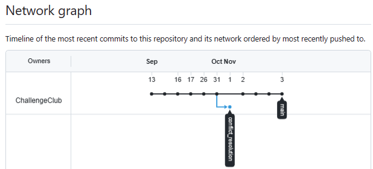
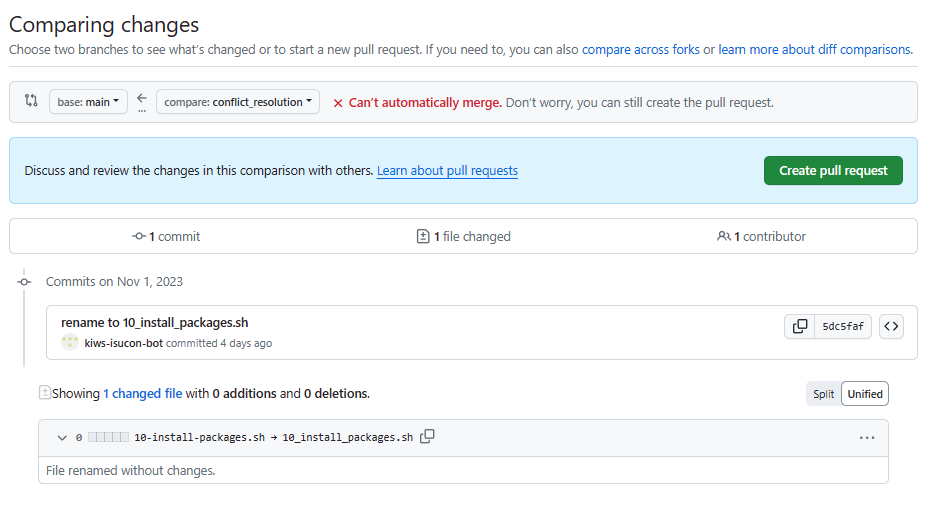
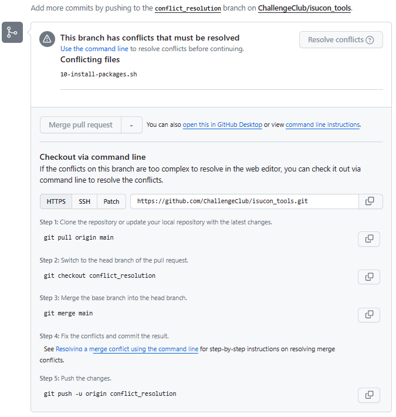
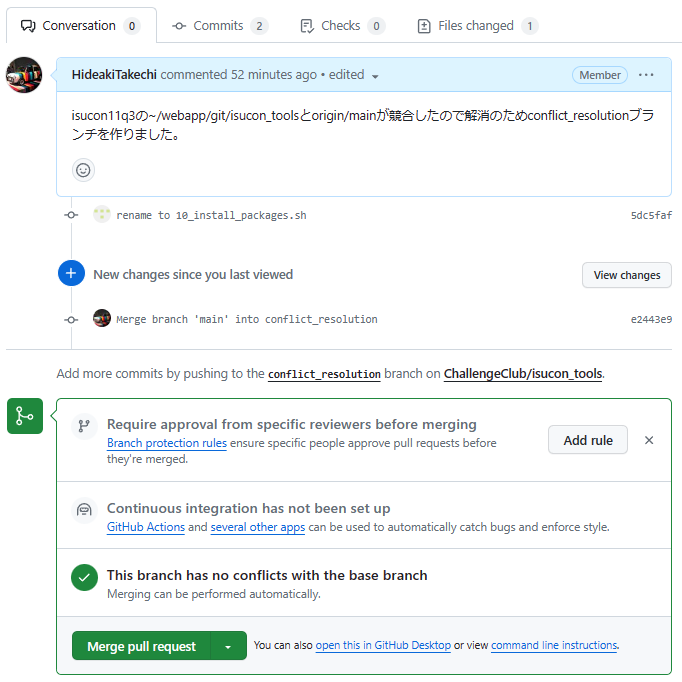
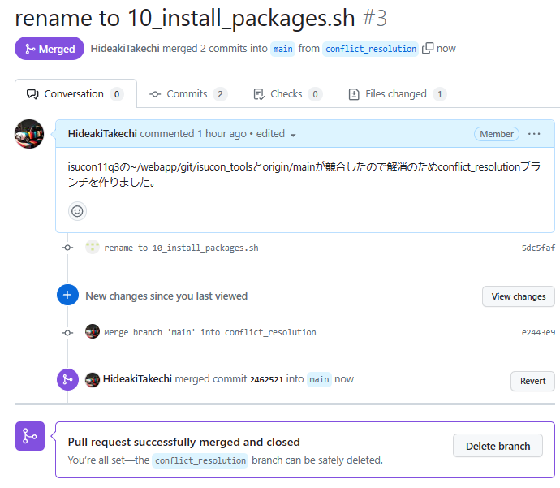
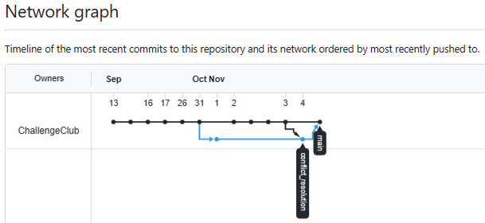

# サマリー
- isucon12q3のisucon_toolsをgit pullしたらconflictが発生していた。
- isucon12q3上の1commitとgithub上で修正した4commitが競合。
- コンフリクト解消練習のためmerge作業実施。

## isucon12q3でconflict発生
```
~/git/isucon_tools$ git pull
hint: You have divergent branches and need to specify how to reconcile them.
hint: You can do so by running one of the following commands sometime before
hint: your next pull:
hint:
hint:   git config pull.rebase false  # merge (the default strategy)
hint:   git config pull.rebase true   # rebase
hint:   git config pull.ff only       # fast-forward only
hint:
hint: You can replace "git config" with "git config --global" to set a default
hint: preference for all repositories. You can also pass --rebase, --no-rebase,
hint: or --ff-only on the command line to override the configured default per
hint: invocation.
fatal: Need to specify how to reconcile divergent branches.
```
## 状態確認
- isucon12q3上の1commitとgithub上で修正した4commitが競合してるとのこと。
```
~/git/isucon_tools$ git status
On branch main
Your branch and 'origin/main' have diverged,
and have 1 and 4 different commits each, respectively.
  (use "git pull" to merge the remote branch into yours)

Untracked files:
  (use "git add <file>..." to include in what will be committed)
        user_info.txt

nothing added to commit but untracked files present (use "git add" to track)
```
- isucon12q3の1commitはファイル名のハイフンをアンダースコアにしたものの様子。  
このままマージして問題なさそう。
```
~/git/isucon_tools$ git log origin/main..main
commit 5dc5faf7a8a4d463c5231724f2dc8519f0075f49 (HEAD -> main)
Author: isucon <kiwasa28+isucon@gmail.com>
Date:   Wed Nov 1 00:16:03 2023 +0900

    rename to 10_install_packages.sh
```

<details><summary>差分確認（~/git/isucon_tools$ git diff origin/main..main）</summary>

```bash
~/git/isucon_tools$ git diff origin/main..main
diff --git a/05_add_webapp_to_github.sh b/05_add_webapp_to_github.sh
index b0a6738..48a1783 100644
--- a/05_add_webapp_to_github.sh
+++ b/05_add_webapp_to_github.sh
@@ -10,5 +10,5 @@ git add *
 git status
 git commit -m "first commit"

-git remote add origin https://github.com/ChallengeClub/isucon12q3.git
+git remote add origin https://github.com/kiws-isucon-bot/isucon12q3-testbot.git
 git push -u origin main
diff --git a/10-install-packages.sh b/10-install-packages.sh
deleted file mode 100755
index 3e703e6..0000000
--- a/10-install-packages.sh
+++ /dev/null
@@ -1,15 +0,0 @@
-#!/bin/sh
-sudo apt -y install prometheus prometheus-node-exporter
-
-# jq install
-sudo apt install -y jq
-
-# alp install
-wget https://github.com/tkuchiki/alp/releases/download/v1.0.18/alp_linux_amd64.tar.gz
-tar xvzf alp_linux_amd64.tar.gz
-sudo mv alp /usr/local/bin/alp
-which alp
-
-# Apache Bench
-# ab install
-sudo apt install -y apache2-utils
diff --git a/10_install_packages.sh b/10_install_packages.sh
new file mode 100755
index 0000000..f3d28ba
--- /dev/null
+++ b/10_install_packages.sh
@@ -0,0 +1,2 @@
+#!/bin/sh
+sudo apt -y install prometheus prometheus-node-exporter
```
</details>

## コンフリクト解消手順
- isucon12q3のcommitをconflict_resolutionというブランチに載せてgithubにpushした。  
（githubに送ってしまうのが皆で確認しながら作業するのに便利というイメージで。）  
```
$ git checkout -b conflict_resolution
Switched to a new branch 'conflict_resolution'
$ git push origin conflict_resolution
Enumerating objects: 3, done.
Counting objects: 100% (3/3), done.
Delta compression using up to 2 threads
Compressing objects: 100% (2/2), done.
Writing objects: 100% (2/2), 249 bytes | 249.00 KiB/s, done.
Total 2 (delta 1), reused 0 (delta 0), pack-reused 0
remote: Resolving deltas: 100% (1/1), completed with 1 local object.
remote:
remote: Create a pull request for 'conflict_resolution' on GitHub by visiting:
remote:      https://github.com/ChallengeClub/isucon_tools/pull/new/conflict_resolution
remote:
To https://github.com/ChallengeClub/isucon_tools.git
 * [new branch]      conflict_resolution -> conflict_resolution
```
- githubのinsghtタブのnetworkを見るととりあえずこんな状況。



- mainにconflict_resolution をマージするプルリクを作成。  
  自動でマージは出来ないと言われるが一旦気にせず作る。



- 作ったプルリクの中身を見ると、ローカルのコマンドラインで実施すべき作業指示の記載がある。



- 作業指示に従って下記実施。  
単にconflict_resolutionにmainの内容をマージして問題なければpushしてねということの模様。  
本来ここでテスト通してOKにする筈。今回は目で見て問題なさそうで通す。

```
$ git pull origin main
From https://github.com/ChallengeClub/isucon_tools
    * branch            main       -> FETCH_HEAD
Merge made by the 'ort' strategy.
    05_add_webapp_to_github.sh |  2 +-
    10_install_packages.sh     | 13 +++++++++++++
    2 files changed, 14 insertions(+), 1 deletion(-)

$ git checkout conflict_resolution
Warning: you are leaving 1 commit behind, not connected to
any of your branches:

    1a04362 Merge branch 'main' of https://github.com/ChallengeClub/isucon_tools into HEAD

If you want to keep it by creating a new branch, this may be a good time
to do so with:

    git branch <new-branch-name> 1a04362

Switched to a new branch 'conflict_resolution'
branch 'conflict_resolution' set up to track 'origin/conflict_resolution'.

hidea@LEVEL_PC MINGW64 /c/dev/isucon/isucon_tools (conflict_resolution)
$ git merge main
Merge made by the 'ort' strategy.
    05_add_webapp_to_github.sh |  2 +-
    10_install_packages.sh     | 13 +++++++++++++
    2 files changed, 14 insertions(+), 1 deletion(-)

hidea@LEVEL_PC MINGW64 /c/dev/isucon/isucon_tools (conflict_resolution)
$ git push -u origin conflict_resolution
Enumerating objects: 4, done.
Counting objects: 100% (4/4), done.
Delta compression using up to 12 threads
Compressing objects: 100% (2/2), done.
Writing objects: 100% (2/2), 290 bytes | 290.00 KiB/s, done.
Total 2 (delta 1), reused 0 (delta 0), pack-reused 0
remote: Resolving deltas: 100% (1/1), completed with 1 local object.
To https://github.com/ChallengeClub/isucon_tools.git
    5dc5faf..e2443e9  conflict_resolution -> conflict_resolution
branch 'conflict_resolution' set up to track 'origin/conflict_resolution'.
```

- 上記作業するとプルリクのconflictが解消してマージ可能になっている。



- マージを承認するとプルリクもクローズ。



- 以上で下図様にマージ出来た。



