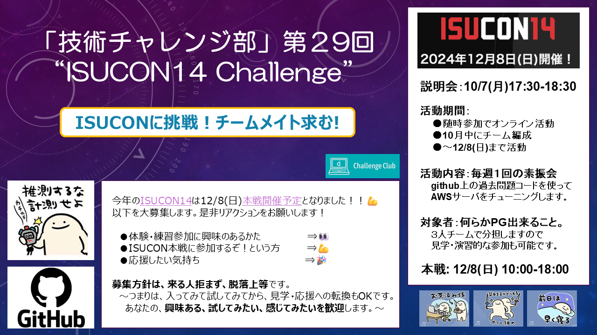

# ISUCONチャレンジの説明会

## 募集の概要

## 募集の詳細
こんにちは！技術チャレンジ部、ISUCON運営です。  
今年のISUCON14 は12/8(日)に本戦開催予定となりました！！参加メンバーを大募集します。   

**【説明会】** 10/7(月)17:30-18:30  
- 体験・練習参加に興味のあるかた　　⇒👀　＃10/7説明会から
- ISUCON本戦に参加するぞ!という方　⇒💪　＃コンタクトください！
- 応援したい気持ち　　　　　　　　　⇒🎉　＃ありがとうございます！
 
**募集方針は、来る人拒まず、脱落上等**です。  
～つまりは、入ってみて試してみてから、見学・応援への転換もOKです。  
あなたの、**興味ある、試してみたい、感じてみたい**を歓迎します。～  

＃Linuxや何らかのプログラミング言語(Python,Nodejs,Go,Rust,Ruby等)が出来る必要がありますが３人組のチーム戦で分担しますので、見学・演習的な参加も可能です。現在３名ｘ４チームでエントリを検討中。お気軽にまずは相談ください。

活動の様子は以下リンクを御覧ください。（本戦当日含めてonlineのみで活動可能）  
- [ISUCON攻略はじめの一歩 #AWS-Qiita](https://qiita.com/hide_take/items/b0c7aa4b854a1fa82fab)  
- [何もわからないけどISUCON13に挑戦してみた #ポエム-Qiita](https://qiita.com/kiwsdiv/items/597506988976702b97e2)  
- [秋の終わりまでにチャレンジしたことLT会](https://speakerdeck.com/hideakitakechi/isuconchu-can-jia-sitekita)
- [ISUCON公式Youtubeチャネル](https://www.youtube.com/@ISUCON_official)  
- [ISUCON13出題動画](https://www.youtube.com/watch?v=OOyInZbM85k)  

コンタクト頂けましたらDiscordサーバとチャネルにご案内します。  
私用PCとgithubとDiscordのアカウントが必要です。  
週１回火曜夜に90分程度の素振り会をしますので、そこに参加いただくのがスムーズ。  
木曜はもくもく会予定。火木とも自分の都合のいい時だけ参加すればＯＫ。  
練習参加はいつからでもＯＫ。使う言語は本戦までにチーム内で相談(去年はGoとRust)。  
本戦参加締め切りは本戦チーム登録が〆切になる10月一杯目途になります。 
