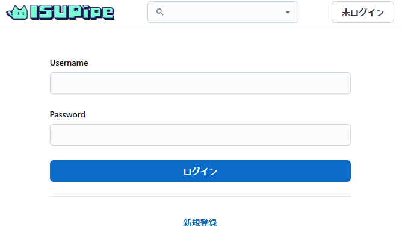
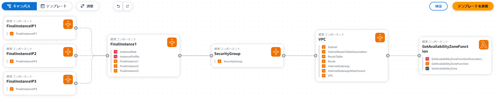

# 本日のサマリー
- AWS過去問EC2を作成し起動した。
- ブラウザでサービス画面を表示した。
- まずEC2作成者がssh接続し各自の公開鍵をgithub経由でEC2に登録してsshで接続した。
- 集まったメンバーの自己紹介をした（ゆーこもじゃなりあわのゆんたんおの）

## EC2起動
- [手順](./20241003_ISUCON13過去問環境.md)に従って過去問AMIからEC2インスタンスを開始（たけ/ゆんたん/おのが各自のAWSコンソールでEC2インスタンス作成）
- 手順中、EC2にPublic IPV4 Addressが付与されない場合があり、インスタンス再作成して「ネットワーク設定」を編集し「パブリック IP の自動割り当て」を有効化した。
- 手順中、EC2にAttachした公開鍵をやっぱり変更したい場合があったが、インスタンスを再作成するしかない様子。
- 本戦はc5.large（数時間なら低コスト）素振りではt2.microあたり多用。（scale up/downのAWS CLI script有り。）

## ブラウザでサービス画面表示
- http,httpsアクセスできる様にEC2のSecurityGroupのInboundルールにhttp,httpsを追加。
- AWSコンソールでインスタンスのPublicIPAddressを取得(`18.181.182.129`)
- ブラウザで`https://18.181.182.129`にアクセスすると、 __Welcome to nginx!__ ページが表示される。
- 自分のPCのhostファイルに下記を追記。(Windowsの場合はC:\Windows\System32\drivers\etc。)
```Hosts File:hosts
18.181.182.129 pipe.u.isucon.local
18.181.182.129 test001.u.isucon.local
```
- ブラウザで`https://pipe.u.isucon.local`にアクセスするとIsupipeのページが表示される。
- test001ユーザは未設定なので一旦ここまで。
<br/>


## 最初にEC2作成者がssh接続
```bash
$ ssh -l ubuntu -i ~/.ssh/hidetake.pem 18.181.182.129
```
- EC2の作成時にAWSコンソールで指定した公開鍵で接続できる。
- Userにはubuntuを指定すること。（ISUCON13過去問はubuntuでログインが可能。isuconには公開鍵が登録されてない。）

## EC2に各自の公開鍵を登録
- 各自に公開鍵を[isucon_tools](https://github.com/ChallengeClub/isucon_tools)に登録してもらう。
- ユーザ別にログインする場合は以下の手順でユーザ作成と公開鍵設定を行う
```bash
$ git clone https://github.com/ChallengeClub/isucon_tools.git
$ cd isucon_tools
$ ./01_createUser.sh $USER $PASSWORD $FULLNAME
$ ./02_installPubkey.sh $USER
```
- isuconユーザでログインする場合は以下の手順でisuconに全員分の公開鍵設定を行う
```bash
$ sudo su isucon -
$ cd ~/.ssh
$ vi authorized_keys  #全員分の公開鍵を追記する。
```

## 各自ssh接続してみる
```bash
$ ssh -l $USER -i ~/.ssh/$USER.pem 18.181.182.129
$ ssh -l isucon -i ~/.ssh/$USER.pem 18.181.182.129
```
各自の環境から接続できました。

## 本戦の様子やツールの話
- AWSアカウントはチームに１人分は必要
- 最初にAWSでCloudFormation(CFn)のファイルを適用するとEC2インスタンスx３作成される。（去年の本戦CFnファイルは[ここ](./data/CFn/cloudformation_contest.yaml)）
- 以降のチューニングはEC2内作業が殆どになる。（ほぼリソースに手を加えられないのでAWSアカウントはあまり使わない。）
- 最初にEC2内のソース構成管理をどう始めるか割と面倒なので事前準備必要。(.gitignoreを書くとか。repoは意外に大サイズOK。) 
<br/>



- Go(go modules)/Rust(Cargo)のPackage管理は使いやすい。Pythonはpipもpipenvも管理がつらい。Poetryとかuvとかが有望。
- 生成AI支援型のCLIターミナル[warp](https://www.warp.dev/)が凄い使いやすい。ゆんたんさんがMac版を活用中。早くWindows版来て欲しい。
- ChatGPTにいつの間にか外部検索機能(RAG)が追加された？

## 振り返り
- 全員素早く各自の環境から過去問題環境にオンボード出来ました :100:  
- 全員分の公開鍵を用意しておけばEC2の作成直後から皆自分の鍵でssh接続できるはず。[autorized_keys](https://github.com/ChallengeClub/isucon_tools/blob/680097f80876da33d72f9b3e6bdc98a0e4485a5d/authorized_keys)を用意したので使ってみます。
- [GitHubに登録してある公開鍵をauthorized_keysに追加する方法](https://qiita.com/itiut@github/items/94b248ba93efee8960d3)も便利そうです。
- 作成したばかりのユーザはシェルの各種設定が無いので使いにくいかも。[ここ](https://qiita.com/iodoform/items/1e79b44b7c7ca342c890)など参考。/bin/bashとかすると吉かも。
- sshのセッションタイムアウトが頻発しました。早々に下記を行うのが吉。（再接続かsshdの再起動が要るかも？）
```bash
$ cd isucon_tools
$ ./04_setupSSH.sh  # ssh keepaliveでタイムアウト抑止、sshパスワードログイン禁止 
```
- WindowsのC:\Windows\System32\drivers\etc\host編集には管理者権限が要るのでメモ帳でない方が書き込みやすい。
- VSCodeRemote接続した際に無応答になって再起動しました。この場合[VSCodeリモート留意点](../2023/20231010_VSCode_RemoteSSH.md#vscode%E3%81%8C%E3%82%B5%E3%83%BC%E3%83%90%E3%83%AA%E3%82%BD%E3%83%BC%E3%82%B9%E3%82%92%E9%A3%9F%E3%81%84%E6%95%A3%E3%82%89%E3%81%8B%E3%81%99)のファイル監視無効化対応が必要です。
