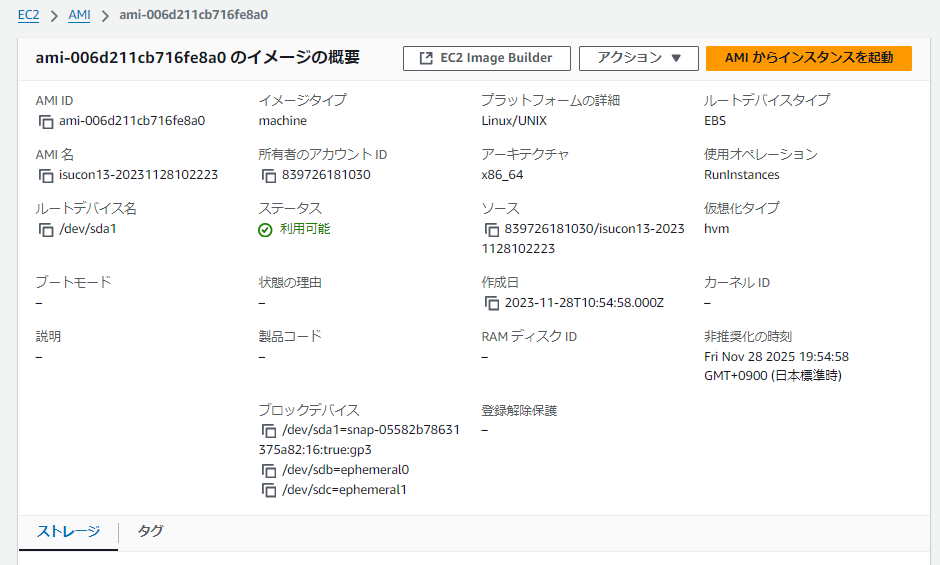

# 本日のサマリー
- ISUCONの可視化ツールの環境設定やサーバー構成管理
- ベンチマーク実行およびSQLの高速化

- 本日もZoomに集まって作業しました。
  - [Zoomレコーディング](https://us06web.zoom.us/rec/share/j8pOo1K_oyZxwNn6KJNro_HflTXPwI_Lx1o2G3yGbEGmwe-_feEFd9o1ikFIGyMb.qQOLeGQ4qyjEksKA?startTime=1731413380000) パスコードを設定する: K+6=2pm*

# 手順

## 可視化ツールの解説

参考：mo124121さんのISUCON可視化ツール詰め合わせリポジトリ。
https://github.com/mo124121/isucon-o11y

上記リポジトリのReadmeを解説いただく。このリポジトリ上でGitHub CodeSpaceを開き、CodeSpace上で作業を進める。

## ISUCON13 AMI起動とSSH接続
### AMIの起動
[matsuu/aws-isucon](https://github.com/matsuu/aws-isucon?tab=readme-ov-file) のAWS環境からISUCON13のAMIを選択し、次の手順に従います。

1. **インスタンスタイプ**：c5.largeを選択（ベンチマーク実行のため）。
2. **キーペアの選択**：既存のキーペアを選択、または新しいキーペアを作成。
3. **インスタンスの起動**



### AWS上でインスタンスのポート開放

セキュリティグループのインバウンドルールを編集して、CodeSpace側のIPアドレスを設定します。

まず、CodeSpaceのIPアドレスを確認します：

```bash
$ curl httpbin.org/ip
{
    "origin":"IPアドレス"
}
```

AWSの設定画面上から、セキュリティグループ>インバウンドルールを編集からルールを追加。


### SSH接続
作成してダウンロードしたキーファイル(ここではisucon13.pem)をCodeSpace上にコピー。(ブラウザ画面上へドラッグ＆ドロップでコピー可能)

ファイルを`~/.ssh/`へ移動し、権限を変更。
```bash
$ chmod 600 ~/.ssh/isucon13.pem
$ ls -al ~/.ssh | grep isucon13.pem
-rw-------  1 codespace codespace 1674 Nov 12 12:27 isucon13.pem
```
権限変更されていることを確認。

先ほど起動したAMIインスタンスのIPアドレスを確認し、SSH接続。
```
$ ssh ubuntu@[IP] -i ~/.ssh/isucon13.pem 
```

### [ssh Timeout設定](https://github.com/ChallengeClub/isucon_tips/blob/main/2023/snipets.md#ssh-timeout%E8%A8%AD%E5%AE%9A)

ssh設定を編集ミスすると２度とインスタンスに入れない場合が有ります。
isucon_tools/04_setupSSH.shを使うか下記の切戻し可能手順がお薦め。
```bash
$ cd /etc/ssh
$ cp sshd_config sshd_config.old          # sshdサーバ設定バックアップ(sshクライアント設定とは別です)
$ vi sshd_config
ClientAliveInterval 30                    # コメントアウトを外してkeepalive秒数を設定
$ sudo service ssh restart                # 再起動で有効化（現在のssh接続は維持されるので切らないこと）  
```
別ターミナルから正常にssh接続出来れば完了. 

## 可視化ツールの設定ファイル修正
### ansible/inventory.yaml
今回はインスタンスが一つであるため、以下のように修正。
```
all:
  hosts:
    server1:
      ansible_host: [IP]
      ansible_user: ubuntu
```

### pprotein/data/targets.json
サーバーのIPアドレスを変更。
```
[
  {
    "Type": "pprof",
    "Label": "web",
    "URL": "http://[IP]:8080/debug/pprof/profile",
    "Duration": 70
  },
  {
    "Type": "httplog",
    "Label": "nginx",
    "URL": "http://[IP]:19000/debug/log/httplog",
    "Duration": 70
  },
  {
    "Type": "slowlog",
    "Label": "mysql",
    "URL": "http://[IP]:19000/debug/log/slowlog",
    "Duration": 70
  }
]
```

### (任意) ansible/roles/mysql/files/etc/mysql/mysql.conf.d/mysqld.cnf
基本的にはISUCON13のサーバーから持ってきて、log出力部のみ追記する。他にボトルネックがない前提ですが、SlowLogがパフォーマンスに影響を与えるため、コンテスト終盤ではSlowLog出力をせずに最高スコアを狙うことも考えられる。

### (任意) ansible/roles/nginx/files/etc/nginx/nginx.conf
基本的にはISUCON13サーバーから持ってきて、Logging Settingを修正する。※ ISUCON本60pでは、アクセスログをjson形式で出力している。

## Ansibleの起動

CodeSpace上で以下実行。
```bash
$ cd ansible
$ ansible-playbook -i inventory.yaml setup_targets.yaml --private-key ~/.ssh/isucon13.pem
```

## 可視化用の各種サーバーの起動
CodeSpace上で以下を実行。
```
$ docker compose up -d
```

## pprotainへのアクセスしてモニタリング

CodeSpaceで"ポート"タブ -> 9000のアドレスを開く。


## ベンチマークの実行

isucon13インスタンス上で、isuconユーザーに変更。
```bash
$ sudo -i -u isucon
```
ベンチマークの実行.

```bash
$ ./bench run --enable-ssl
```

pprotainブラウザ画面上で"Collect"ボダンをクリックして、ログ収集開始。

pprotain画面上で、ログを表示できる。タブごとにソート可能なので、例えば"Sum"タブで一番時間がかかった処理を見つける等、解析することができる。


## SlowLog解析および改善

SlowLog解析を行い、MYSQLにインデックスを貼ることでアクセス回数を減らして高速化する。

pprotain上で時間がかかってそうな処理に着目する。


CodeSpace上でmysqlを開く。
```
$ sudo mysql
```
EXPLAIN で街頭の MySQL がクエリをどのように実行しようとしているかを確認する。

```sql
mysql> explain SELECT * FROM `livestream_tags` WHERE `livestream_id` = 3;
+----+-------------+-----------------+------------+------+---------------+------+---------+------+-------+----------+-------------+
| id | select_type | table           | partitions | type | possible_keys | key  | key_len | ref  | rows  | filtered | Extra       |
+----+-------------+-----------------+------------+------+---------------+------+---------+------+-------+----------+-------------+
|  1 | SIMPLE      | livestream_tags | NULL       | ALL  | NULL          | NULL | NULL    | NULL | 11349 |    10.00 | Using where |
+----+-------------+-----------------+------------+------+---------------+------+---------+------+-------+----------+-------------+
1 row in set, 1 warning (0.01 sec)
```
rowsを見ると、MySQL が予測するスキャン行数が分かる。ここでは 11349 行をスキャンすると予測している。

次のコマンドで livestream_id 列にインデックス lididx を作成する。

```sql
mysql> create index  lididx on livestream_tags (livestream_id);
Query OK, 0 rows affected (0.11 sec)
Records: 0  Duplicates: 0  Warnings: 0
```

```sql
mysql> explain SELECT * FROM `livestream_tags` WHERE `livestream_id` = 3;
+----+-------------+-----------------+------------+------+---------------+--------+---------+-------+------+----------+-------+
| id | select_type | table           | partitions | type | possible_keys | key    | key_len | ref   | rows | filtered | Extra |
+----+-------------+-----------------+------------+------+---------------+--------+---------+-------+------+----------+-------+
|  1 | SIMPLE      | livestream_tags | NULL       | ref  | lididx        | lididx | 8       | const |    1 |   100.00 | NULL  |
+----+-------------+-----------------+------------+------+---------------+--------+---------+-------+------+----------+-------+
1 row in set, 1 warning (0.00 sec)
```
- type: ALL から ref に変わり、全表スキャンが避けられてる。
- key: lididx インデックスが実際に使われていることが確認できる。
- rows: 11349 行から1 行のみをスキャンするようになり、効率が大幅に向上している。
filtered: 100.00 となり、インデックスにより条件に合致するデータがすぐに取得できるようになったことが示されている。

ベンチマークを再実行すると、スコアが2000点程度から3000点へ向上していることが分かる。

Slowlogでも該当のクエリの時間が160(ms)から5(ms)に改善していることが分かる。


## 参考 MySQLでの改善手法
- 1. webapp/sql/init/init.sql に追記する
例えば、以下のように末尾に追記する。
```sql
TRUNCATE TABLE themes;
TRUNCATE TABLE icons;
TRUNCATE TABLE reservation_slots;
TRUNCATE TABLE livestream_viewers_history;
TRUNCATE TABLE livecomment_reports;
TRUNCATE TABLE ng_words;
TRUNCATE TABLE reactions;
TRUNCATE TABLE tags;
TRUNCATE TABLE livestream_tags;
TRUNCATE TABLE livecomments;
TRUNCATE TABLE livestreams;
TRUNCATE TABLE users;

ALTER TABLE `themes` auto_increment = 1;
ALTER TABLE `icons` auto_increment = 1;
ALTER TABLE `reservation_slots` auto_increment = 1;
ALTER TABLE `livestream_tags` auto_increment = 1;
ALTER TABLE `livestream_viewers_history` auto_increment = 1;
ALTER TABLE `livecomment_reports` auto_increment = 1;
ALTER TABLE `ng_words` auto_increment = 1;
ALTER TABLE `reactions` auto_increment = 1;
ALTER TABLE `tags` auto_increment = 1;
ALTER TABLE `livecomments` auto_increment = 1;
ALTER TABLE `livestreams` auto_increment = 1;
ALTER TABLE `users` auto_increment = 1;

-- Add index to improve query performance on livestream_tags
CREATE INDEX lididx ON livestream_tags (livestream_id);
```

- 2. main.go 上で追記する

参考：
https://github.com/saba-in-the-kettle/isucon13/blob/a19c66932c4c53345117e4c09d47c44c4db3b38c/go/isuutil/db.go#L71-L87

https://github.com/saba-in-the-kettle/isucon13/blob/a19c66932c4c53345117e4c09d47c44c4db3b38c/go/main.go#L119-L122

# Zoom要約
## 要点
チームはISUCONの可視化ツールの環境設定やサーバー構成管理について議論し、様々なツールの使用方法を探りました。パフォーマンス改善のための技術やデータベース関連の作業、今後の計画についても話し合いが行われました。最後に、今後の議論のために会議の録画を共有することで締めくくられました。

## 要約
### Isucon可視化ツール環境

Moは、ISUCONの可視化ツールの環境をまとめたGitHubリポジトリについて説明し、主にPrometheusとGrafanaの使用方法を紹介する。サーバーとエージェントの関係、ログ解析の重要性、そしてNginxのアクセスログ解析のためのGrokパターンの設定方法について詳しく説明する。また、ChatGPTを活用してGrokパターンを効率的に生成する方法も提案し、参加者に実践的なアドバイスを提供する。

### SSH 設定とセキュリティ

Kenta と mo は、SSH 設定とセキュリティに関する作業を行っています。彼らは .ssh ディレクトリの作成、ファイルのパーミッション変更、そして EC2 インスタンスへの SSH 接続を実施します。最後に、Ansible について触れ、Kenta が後日その内容を復習することを確認します。

### サーバー構成管理の改善

MoとKentaはAnsibleを使用したサーバー構成管理について議論し、インベントリファイルの設定、プレイブックの実行、MySQLとNginxの設定ファイルの調整について話し合う。特に、スローログの設定やログ出力の重要性が強調され、コンテストのスコア向上のためにこれらの設定を適切に調整する必要性が指摘される。最後に、パフォーマンス向上のための最終段階として、ログ出力をオフにする方法についても言及される。

### Peprotein Service Setup and Testing

MoとKentaは、コードスペース上でDockerComposeを使用してPeproteinサービスを実行し、AWSのセキュリティグループ設定を調整してアクセスを可能にする作業を行う。彼らは、Peproteinの測定機能を確認し、初期化処理後に測定サーバーに対して自動的に測定を開始する機能について議論する。最後に、moとKentaはAWSインスタンスのセキュリティグループを設定し、コードスペースからPeproteinにアクセスできるようにする。

### Httpログの分析と改善

MoはHTTPログとスロークエリログの分析方法を説明し、パフォーマンス改善のためのアプローチを示す。Kentaと武知は、データベースチューニングの手法やインデックスの追加・変更について議論する。最後に、最も遅いクエリを特定し、EXPLAINコマンドを使用して実行計画を分析し、ChatGPTなどのツールを活用して改善策を検討することが提案される。

### インデックス作成の2つの方法

MoとKentaは、データベースのインデックス作成に関する議論を行う。moは、ソースコードを変更せずにインデックスを作成する方法として、SQLファイルを編集する方法と、Goのコードでインデックス作成関数を実装する方法を提案する。Kentaは、GPT-4を使用してSQLファイルの編集を試みるが、moは管理の複雑さを指摘し、代わりにGoのユーティリティ関数を使用する方法を推奨する。最終的に、moはRustでも同様のアプローチが可能であることを説明し、Kentaはこの方法を理解して実装することを検討する。

### ミーティングの録画と共有

この会議では、ミーティングの録画と共有方法について議論されました。Kentaがズームの録画履歴をリポジトリに貼り付けることを提案し、参加者はパスコードの扱いや公開範囲について意見を交換しました。最終的に、現状のパブリックな設定を維持することが決定され、Kentaが議事録を作成することになりました。会議の終わりに、参加者全員が感謝の言葉を述べ、会議は終了しました。
