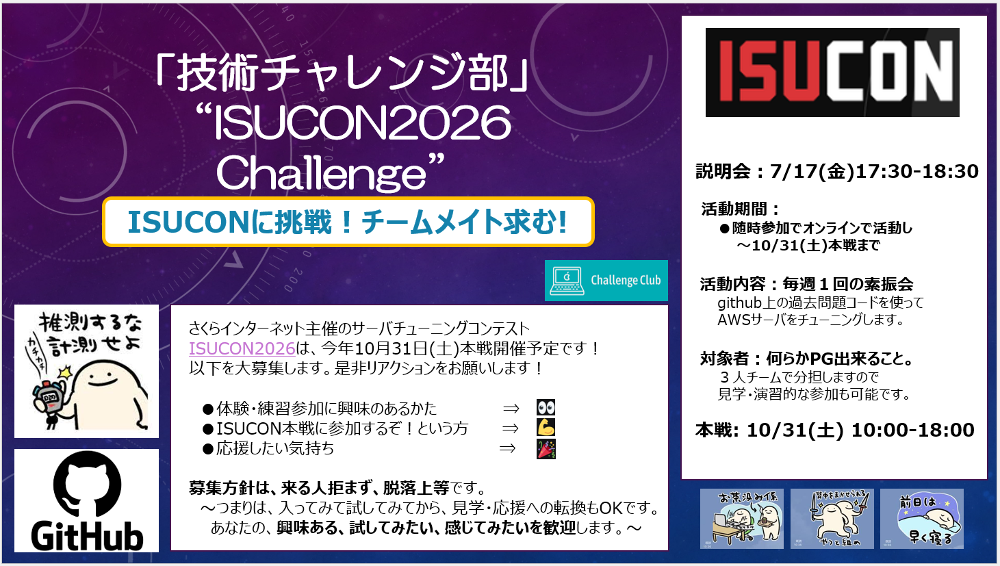

# ISUCONチャレンジ説明会

## 募集の概要


## 募集の詳細
こんにちは！技術チャレンジ部、ISUCON2026 Challenge 運営です。  
今年のISUCON2026 は10/31(土)に本戦開催予定となりました！！参加メンバーを大募集します。   

**【説明会】** 7/17(金)17:30-18:30  
- 体験・練習参加に興味のあるかた　　⇒👀　＃10/7説明会から
- ISUCON本戦に参加するぞ!という方　⇒💪　＃コンタクトください！
- 応援したい気持ち　　　　　　　　　⇒🎉　＃ありがとうございます！
 
**募集方針は、来る人拒まず、脱落上等**です。  
～つまりは、入ってみて試してみてから、見学・応援への転換もOKです。  
あなたの、**興味ある、試してみたい、感じてみたい**を歓迎します。～  

＃Linuxや何らかのプログラミング言語(Python,Nodejs,Go,Rust,Ruby等)が出来る必要がありますが３人組のチーム戦で分担しますので、見学・演習的な参加も可能です。

活動の様子は以下リンクを御覧ください。（本戦当日含めてオンラインのみで活動可能）  
- [ISUCON攻略はじめの一歩 #AWS-Qiita](https://qiita.com/hide_take/items/b0c7aa4b854a1fa82fab)  
- [何もわからないけどISUCON13に挑戦してみた #ポエム-Qiita](https://qiita.com/kiwsdiv/items/597506988976702b97e2)  
- [秋の終わりまでにチャレンジしたことLT会](https://speakerdeck.com/hideakitakechi/isuconchu-can-jia-sitekita)
- [ISUCON公式Youtubeチャネル](https://www.youtube.com/@ISUCON_official)  
- [ISUCON13出題動画](https://www.youtube.com/watch?v=OOyInZbM85k)  

コンタクト頂けましたらDiscordサーバとチャネルにご案内します。  
**私用のPCとgithubとDiscordのアカウントが必要です。**  
週１回火曜夜に90分程度の素振り会をしますので、そこに参加いただくのがスムーズ。  
木曜はもくもく会予定。火木とも自分の都合のいい時だけ参加すればＯＫ。  
練習参加はいつからでもＯＫ。使う言語は本戦までにチーム内で相談(前回はGoとRust)。  
本戦参加締め切りは本戦チーム登録が〆切になる7月一杯目途になります。 

# ISUCONチャレンジャー募集説明会(2026/07/17　17:30～18：30)

## 1. ISUCONとは？

**ISUCON（Iikanjini Speed Up Contest）**は、Webサービスを高速化する技術コンテストです。

与えられたWebサービスに対して、

* どこが遅いのかを調査する
* 原因を分析する
* 改善する
* ベンチマークで効果を確認する

というサイクルを繰り返し、どれだけ性能を向上できるかを短時間でチームで競います。

単に速いコードを書く大会ではなく、

**「計測して、考えて、改善する力」**

を競うイベントです。

---

## 2. ISUCONでは何をするのか？

大会では、Webサービスが1つ用意されています。

例えば、

```
ユーザー操作
    ↓
Webアプリケーション
    ↓
データベース
    ↓
レスポンス返却
```

という流れの中で、

* アプリケーションの処理が遅い？
* SQLが原因？
* データベースの設定？
* キャッシュを使える？
* サーバ設定に問題がある？

などを調査します。

そして改善を行い、ベンチマークを実行してスコアを確認します。

改善例：

```
改善前：
ページ表示 5秒

↓

原因調査：
データベース検索がボトルネック

↓

改善：
SQL改善、インデックス追加

↓

改善後：
ページ表示 0.5秒
```

このような改善をチームで積み重ねていきます。

---

## 3. 初心者でも参加できます

「ISUCONは詳しい人しか参加できないのでは？」

と思うかもしれません。

しかし、最初からすべての知識が必要なわけではありません。

大切なのは、

* 分からないことを調べる力
* 仮説を立てる力
* チームで相談する力
* 改善を楽しむ気持ち

です。

---

## 4. いろいろな経験が活かせます

ISUCONでは、さまざまなスキルが役立ちます。

| 経験       | 活かせること         |
| -------- | -------------- |
| Webアプリ開発 | コード改善、処理高速化    |
| データベース経験 | SQL改善、インデックス設計 |
| インフラ経験   | サーバ設定、性能改善     |
| テスト経験    | 計測、検証、品質確認     |
| 障害調査経験   | ログ分析、原因特定      |

普段の業務で身につけた経験が、そのまま活かせる場面があります。

---

## 5. ISUCONに参加するメリット

参加することで、以下のような力を伸ばせます。

* Webサービス全体を見る力
* パフォーマンス改善の考え方
* Linux操作
* SQLチューニング
* ログ分析
* ボトルネック調査
* チームで問題解決する経験

普段の開発では触れる機会が少ない領域も、実践的に学ぶことができます。

---

## 6. 参加までの流れ（予定）

大会に向けて、以下のような準備を行います。

* ISUCON概要理解
* 過去問やPrivate ISUを使った練習
* Docker環境構築
* Webアプリ構成の理解
* 性能改善の練習
* チームでの作戦検討

分からない部分は調べながら、一緒に準備していきます。

---

## 7. こんな人におすすめです

* Webサービスの仕組みに興味がある人
* 性能改善に興味がある人
* 障害調査や原因分析が好きな人
* 新しい技術を試してみたい人
* チームで技術的な挑戦をしたい人

経験年数や得意分野は問いません。

---

## 8. 一緒にISUCONへ挑戦しませんか？

ISUCONは、知らない技術に出会い、試行錯誤しながら成長できるイベントです。

最初は分からないことがあって当然です。

チームで協力しながら、Webサービスを速くする楽しさを体験しましょう。

ぜひ一緒に挑戦しましょう！
---

## 9. 登録方法

お問い合わせ先までご連絡ください。

活動場所であるDiscordの招待URLをお渡しします。

Discordに入ったら、#ISUCONチャネルで指名と所属の自己紹介をお願いいたします。


