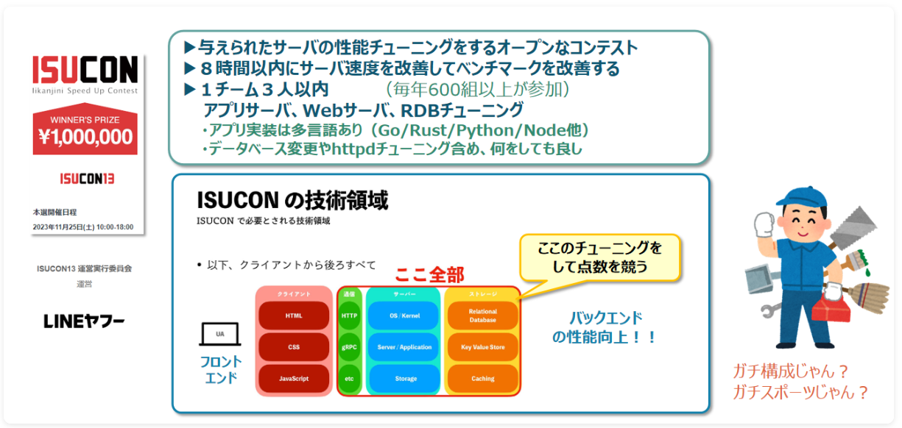
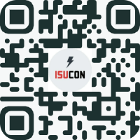

# ISUCONチャレンジ説明会

## 募集の概要


## 募集の詳細
こんにちは！技術チャレンジ部、ISUCON2026 Challenge 運営です。  
今年のISUCON2026 は10/31(土)に本戦開催予定となりました！！参加メンバーを大募集します。   

**【説明会】** 7/17(金)17:30-18:30  
- 体験・練習参加に興味のあるかた　　⇒👀　＃10/7説明会から
- ISUCON本戦に参加するぞ!という方　⇒💪　＃コンタクトください！
- 応援したい気持ち　　　　　　　　　⇒🎉　＃ありがとうございます！
 
**募集方針は、来る人拒まず、脱落上等**です。  
～つまりは、入ってみて試してみてから、見学・応援への転換もOKです。  
あなたの、**興味ある、試してみたい、感じてみたい**を歓迎します。～  

＃Linuxや何らかのプログラミング言語(Python,Nodejs,Go,Rust,Ruby等)が出来る必要がありますが３人組のチーム戦で分担しますので、見学・演習的な参加も可能です。

活動の様子は以下リンクを御覧ください。（本戦当日含めてオンラインのみで活動可能）  
- [ISUCON攻略はじめの一歩 #AWS-Qiita](https://qiita.com/hide_take/items/b0c7aa4b854a1fa82fab)  
- [何もわからないけどISUCON13に挑戦してみた #ポエム-Qiita](https://qiita.com/kiwsdiv/items/597506988976702b97e2)  
- [秋の終わりまでにチャレンジしたことLT会](https://speakerdeck.com/hideakitakechi/isuconchu-can-jia-sitekita)
- [ISUCON公式Youtubeチャネル](https://www.youtube.com/@ISUCON_official)  
- [ISUCON13出題動画](https://www.youtube.com/watch?v=OOyInZbM85k)  

コンタクト頂けましたらDiscordサーバとチャネルにご案内します。  
**私用のPCとgithubとDiscordのアカウントが必要です。**  
週１回火曜夜に90分程度の素振り会をしますので、そこに参加いただくのがスムーズ。  
木曜はもくもく会予定。火木とも自分の都合のいい時だけ参加すればＯＫ。  
練習参加はいつからでもＯＫ。使う言語は本戦までにチーム内で相談(前回はGoとRust)。  
本戦参加締め切りは本戦チーム登録が〆切になる7月一杯目途になります。 

# 技術チャレンジ部の紹介
[技術チャレンジ部の紹介](https://challenge-club.org/#top)

# ISUCONチャレンジャー募集説明会(2026/07/17　17:30～18:30)

## 🚀 1. ISUCONとは？

ISUCON（Iikanjini Speed Up Contest） は、重いWebサービスをチームで高速化するエンジニアの大会です。


与えられたWebサービスに対して、

* どこが遅いのかを調査する
* 原因を分析する
* 改善する
* ベンチマークで効果を確認する（ベンチマーカーとは性能をスコアで表すツール）

というサイクルを繰り返し、どれだけ性能を向上できるかを短時間でチームで競います。

単に速いコードを書く大会ではなく、
```
🐢 遅い

      ↓
🔍 計測

      ↓
💡 原因分析

      ↓
🔧 改善

      ↓
📈 ベンチマーク（性能をスコア化）

      ↓
🚀 スコアアップ！
```
を競うイベントです。

🐤経験者談：

前回のISUCON14では、全体で834チーム(参加者数1920名)がエントリー

技術チャレンジ部からは3チームが参戦。

結果は、

51位 cc4チーム(22,274点)　（参考：1位のチームのスコア 37,127点）

446位 cc3チーム(3,193点)

失格　しばいぬチーム（最後の最後で環境が壊れて失格。壊れていなければ2,968点）

チームは、上位を狙うチームからほのぼのチームまで様々です。

わたしのチームは、しばいぬチームでとても悔しい結果に終わりました。。。

ことしは環境を壊さず完走することを個人目標にしています（笑）。

---

## 🔍 2. ISUCONでは何をするのか？

大会では、Webサービスが1つ用意されています。

過去問　ISUCON13

YouTubeのようなisupipeという動画配信サイトにて・・・
https://www.youtube.com/watch?v=OOyInZbM85k

例えば、

```
ユーザー操作
    ↓
Webアプリケーション
    ↓
データベース
    ↓
レスポンス返却
```

という流れの中で、

* アプリケーションの処理が遅い？
* SQLが原因？
* データベースの設定？
* キャッシュを使える？
* サーバ設定に問題がある？

などを調査します。

そして改善を行い、ベンチマークを実行してスコアを確認します。

改善例：

```
🐢動画一覧表示

↓

SQLが500ms

↓

インデックス追加

↓

50ms

↓

スコアアップ！
```

このような改善をチームで積み重ねていきます。

🐤経験者談：

前回参加したわたしは、C++のif文やfor文が書けて、Linuxもcdとpwdくらいしか知らない人でした。

本番まで、練習して少しずつスコアを稼げるようになりました。

１つの技法を覚えるだけでも十分戦えます。

---

## 🌱 3. 初心者でも参加できます

「ISUCONは詳しい人しか参加できないのでは？」

と思うかもしれません。

しかし、最初からすべての知識が必要なわけではありません。

大切なのは、

* 分からないことを調べる力
* 仮説を立てる力
* チームで相談する力
* 改善を楽しむ気持ち

です。

---

## 🛠️ 4. いろいろな経験が活かせます

ISUCONでは、さまざまなスキルが役立ちます。

| 経験       | 活かせること         |
| -------- | -------------- |
| ✔Webアプリ開発 | コード改善、処理高速化    |
| ✔データベース経験 | SQL改善、インデックス設計 |
| ✔インフラ経験   | サーバ設定、性能改善     |
| ✔テスト経験    | 計測、検証、品質確認     |
| ✔障害調査経験   | ログ分析、原因特定      |

普段の業務で身につけた経験が、そのまま活かせる場面があります。

🐤経験者談：

分からないことが多い分、参加した後にはWEB全般の色々な分野の知識が身に付きます！

---

## 🎁 5. ISUCONに参加するメリット

参加することで、以下のような力を伸ばせます。

* Webサービス全体を見る力
* パフォーマンス改善の考え方
* Linux操作
* SQLチューニング
* ログ分析
* ボトルネック調査
* チームで問題解決する経験

🐤経験者談：

普段の開発では担当が細分化されていて、自分の担当以外のエリアは分かりませんが、

これまで触れる機会が少なかった領域にも、改善を加えて実践的に学ぶことができ、

エンジニアとして視野が広がりました。

---

## 📅 6. 参加までの流れ

大会に向けて、以下のような準備を行います。

* ISUCON概要理解
* WebパフォーマンスチューニングISUCONの読み込み
* 過去問やPrivate ISUを使った練習
* Webアプリ構成の理解
* 性能改善の練習
* チームでの作戦検討

分からない部分は調べながら、一緒に準備していきます。

📍 活動場所
　Discord

📅 毎週火曜日 21:00〜
　正式集会日（素振り会）

☕ 毎週木曜日 21:00〜
　ゆるゆる集会日（もくもく会）

⏰ 活動時間
　1回90分程度（色んなメンバーでチームづくりしつつ、息切れしない様に良いペースを探っていきます。）

🐤経験者談：

技術の団体戦は、あまり見られないものですが、チームメンバーとの信頼関係が培われとても楽しいイベントになります。

---

## 🙋 7. こんな人におすすめ


* Webサービスの仕組みに興味がある人
* 性能改善に興味がある人
* 障害調査や原因分析が好きな人
* 新しい技術を試してみたい人
* チームで技術的な挑戦をしたい人

経験年数や得意分野は問いません。

🐤経験者談：

前回は最後の最後で環境を壊して失格になりました。

それでも「また挑戦したい」と思えるくらい楽しい大会です。

騙されたと思って登録して頂ければと思います。笑

---

## 🎉 8. 一緒にISUCONへ挑戦しませんか？

🎯 こんな人はぜひ！

🌐 Webサービスの仕組みをもっと知りたい！

⚡ パフォーマンス改善を体験したい！

🤝 チームで技術的な挑戦をしてみたい！

そんな方は大歓迎です！

### 一緒に今年のISUCONを楽しみましょう！ 

---

## 📝 9. 登録方法

下記のQRコードでDiscordへご入室ください。

Discordに入ったら、#isuconチャネルで名前と所属の自己紹介をお願いいたします。



---

## 🌱 10. 初回の活動日

📅 日時
7月23日（木）21:00～

👋 内容
オンボーディング（自己紹介）

💬 「どんな人が参加しているの？」「どんな雰囲気なんだろう？」

そんな疑問を解消するための、気軽な顔合わせ会です！

初めての方も大歓迎です😊


