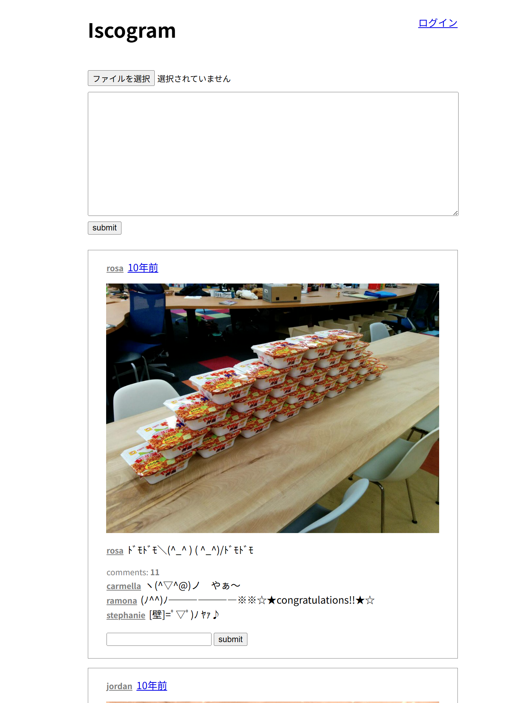
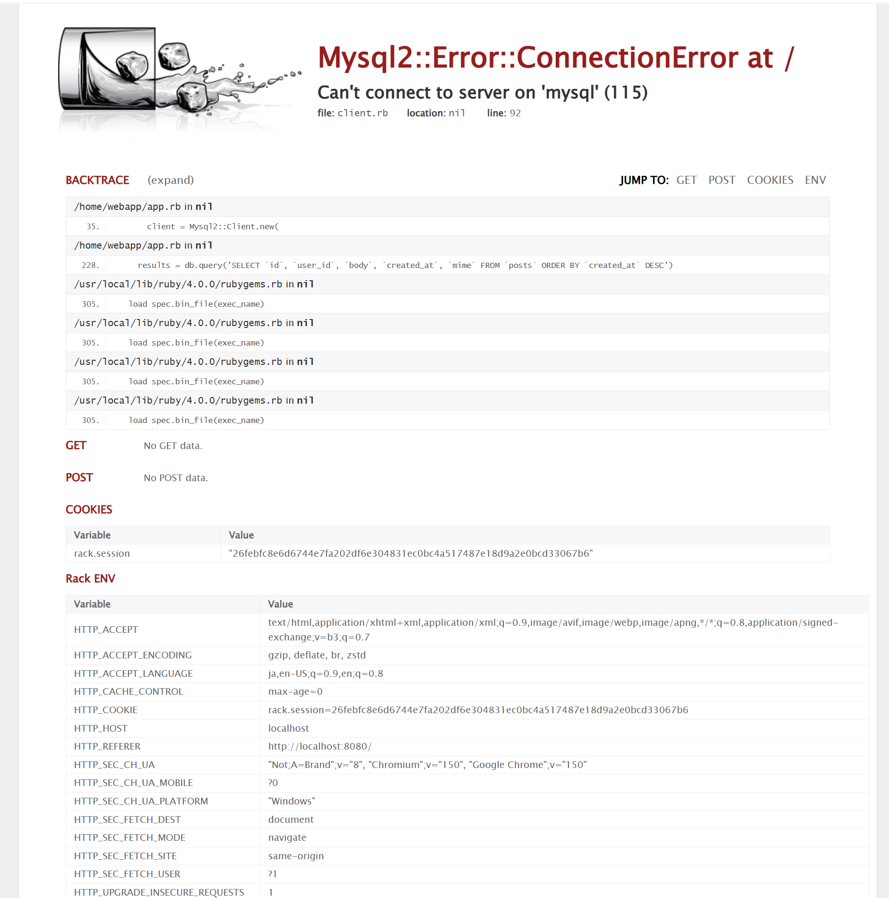

参加者：nuno8、モリアイ、とも、ひでたん、ゆーこ、おの

# やりたいこと
- ssh鍵生成とgithubへの設定（←あとからでOK）
- 同じ共同作業用のAWS(isupipe)にみんなで入る
- private-isu環境を各自のWSL上に作る！！（←こちらで実施）
　参考：https://github.com/catatsuy/private-isu

nuno8さんの環境でPrivate isuを立ち上げていく

# private-isuチャレンジ
## リポジトリの取得
- `https://github.com/catatsuy/private-isu`
## docker環境の構築
- 自分の場合はdocker engineを使用
## データベースの取得
```shell
cd private-isu
make init
```

### unzipがないと怒られたとき

```shell
sudo apt-get install zip unzip
```

## webapp起動
```shell
cd webapp
docker compose up -d
```
### ポート競合が発生した場合

[READMEのポートの競合](https://github.com/catatsuy/private-isu#%E3%83%9D%E3%83%BC%E3%83%88%E3%81%AE%E7%AB%B6%E5%90%88)を参照

## 待つ、結構待つ

成功した場合はブラウザで`http://localhost:80/`にアクセスすると以下のページが出る。


待ちが足らないと、mysqlに接続できませんエラーとなる


## ベンチマーク

### 初回ベンチマーク
ともさん：スコア1400🎉🚀🚀

### トラブルシューティング

以下のようなエラーが出てベンチマークができない場合
（WSL + docker desktopの環境が原因？）

```log
docker run --network host -i private-isu-benchmarker /bin/benchmarker -t http://host.docker.internal -u /opt/userdata
{"pass":false,"score":0,"success":0,"fail":8,"messages":["response code should be 200, got 404 (POST /login)","response code should be 200, got 404 (POST /register)"]}
```

以下のコマンドであれば実行可能な場合がある
```shell
docker run --network private-isu_my_network -i private-isu-benchmarker /bin/benchmarker -t http://nginx:80 -u /opt/userdata
```

結果

```log
{"pass":true,"score":1235,"success":1060,"fail":0,"messages":[]}
```
