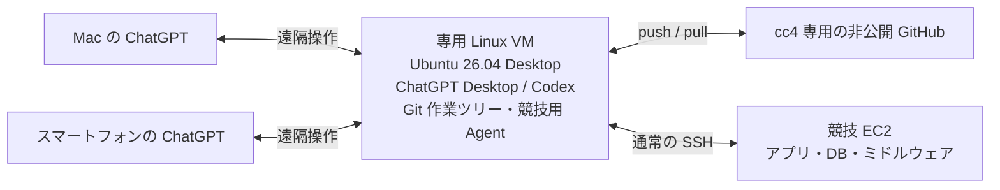

# ChallengeClub4（cc4）: Codex による ISUCON2026 自動化計画

更新: 2026-10-07 / 状態: 通常SSHでの調査・取得と、専用スキルによるISUCON14の改善サイクル一周・復元を確認。次は非公開リポジトリとISUCON13環境で検証する

## 当日向けの事前学習資料

人間側の作業は [準備・当日チェックリスト](./human-checklist.md) にまとめた。GitHub Appの公開リポジトリアクセス制限、AWS・AMI・鍵・時刻・SSH設定、クーポン（配布時）、Discord・ポータル監視を担当と期限付きで確認する。

新しいチャットでは [当日の入口](./contest-start.md) から読み始める。公式の当日マニュアルと実際の計測結果を優先し、過去問の解法を今年の仕様として扱わない。

- [過去問の傾向と2026の確認事項](./past-contest-research.md): 11〜14の公式講評、作問者の実践記事、AI利用の参加者報告を出典付きで整理。確認済み事実と推論・未確認事項を区別する。
- [改善の手引き](./performance-playbook.md): 症状から選ぶ計測と仮説、適用条件、正しさの注意点、検証・復元の判断。
- [EC2調査とソース取得](./ec2-source-workflow.md): 公開リポジトリがない環境での選別取得と読解。

調査日は2026-10-07。資料は公開された過去問に基づく準備情報で、競技中の実環境情報は非公開のSTATUS.md等へ保存する。

## cc4専用スキル

[スキル原本と使い方](./skills-guide.md)に、Go性能調査と原因調査・結果検証の2つを用意した。公開原本から本戦のローカル環境へ一方向に取り込み、取得元コミットを記録する。形式検証とISUCON14での改善サイクル一周（比較ベンチ、不採用案の復元まで）を確認済み。スキルが性能改善へどれだけ寄与するかは未評価で、次は非公開リポジトリへの取り込みとISUCON13等での検証を進める。

## 目的と活動の位置付け

企業の有志活動「技術チャレンジ部」の ISUCON メンバー7人で、Discord の定例会・練習と GitHub への TIPS 蓄積を進めている。
cc4 は ChallengeClub4 の略で、人間の参加者と Codex により、AI エージェント全自動でどこまで改善できるかを試す競技参加チーム。運営へのエントリーは済んでいる。AI は人間の登録選手を意味するものではない。

この文書は事前準備の設計・手順と一部の練習結果をまとめたもの。構成全体や自動改善の動作確認は未完了。大会当日のマニュアルと最新の公式資料を確認して更新する。

## 公開 TIPS と競技用リポジトリの分離

この isucon_tips は **公開リポジトリ**。ここには一般的な準備手順・公開可能な練習 TIPS を保存する。

**競技中は公開先を更新しない。GitHub連携の書き込み権限や事前準備での公開承認は、本戦情報の公開許可ではない。** 当日の出題・改善・計測結果は自チーム限定の非公開領域へ保存する。具体的な送信経路・誤公開時の対応・終了後の扱いは [当日の公開防止方針](./contest-start.md#本戦情報を公開しないための運用方針) を参照する。
競技中の問題コード、攻略情報、ベンチ結果、当日マニュアル、認証情報は保存しない。

本戦用に cc4 専用の **別の非公開 GitHub リポジトリ**を事前作成する。
アクセスは cc4 に必要な人・エージェントに限定し、他チームのメンバーには競技終了まで共有しない。
部活動の Discord にも本戦中の問題・改善内容を共有しない。定例会での合同練習と本戦での情報共有を区別する。
非公開であってもアクセス範囲に注意する。秘密鍵、AWS/Codex の認証トークン、パスワードは Git に入れない。

## 採用する構成



| 場所 | 役割 |
|---|---|
| Mac・スマートフォン | VM 上のチャット・進捗の確認と追加指示。差分・通知・承認の各機能は練習で確認 |
| 専用 Linux VM | Ubuntu 26.04 Desktop 上の ChatGPT Desktop / Codex の実行、コード検索・修正、Git、テスト、配備、実験記録 |
| 非公開 GitHub | 履歴の保存、差分・実験結果の観測、復旧用コピー |
| 競技 EC2 | サービス実行、実環境の調査、公式ベンチでの性能検証 |

専用 VM にコードを置き、検索・編集を通常のローカルファイル操作として行う。
競技 EC2 は実際のログ、DB、設定、性能を調べる場所。VM のテストだけで性能改善を判断しない。
Codex の作業負荷・認証情報・履歴を競技サーバーから分離し、EC2 の再起動に備える。
外部 VM は開発・モニタリング用とし、採点対象の Web サービスの処理は許可された競技サーバー内で完結させる。

### 専用 Linux Desktop VM を中心にする理由

- 普段使いの Windows とエージェント用の権限・資格情報を VM 単位で分離する。
- Codex 以外のエージェントを動かす VM も用意する予定があり、その基盤として活用する。
- Ubuntu 26.04 Desktop の利用経験を積む。
- Windows と Linux 間の通信に懸念があり、競技の必須経路から外す。
- SSH over SSM の仕組みを練習で確認し、競技では通常の SSH で改善作業に集中する。

Windows アプリを経由する構成は採用構成から外し、Mac・スマートフォンから Linux VM の Desktop アプリを直接遠隔操作する。
同じ VM 上の他エージェントが競技資格情報や作業ツリーにアクセスできる範囲は、ユーザー・権限・実行環境で分離して確認する。

### 導入済みと残る確認

ユーザーの報告により、Ubuntu 26.04 Desktop の VM、ChatGPT Desktop の導入、Mac・スマートフォンからの遠隔操作を確認済み。
VM 上のローカルプロジェクトを作業の中心にする。Windows の SSH リモートプロジェクトや CLI の experimental remote-control は、本番の必須経路にしない。

- VM の電源、ネットワーク、Desktop セッション、アプリを維持し、スリープや自動更新による中断を管理する。
- 差分表示、通知、承認、追加指示を Mac・スマートフォンで一周確認する。
- クライアント切断・アプリ再起動・VM 再起動後の復旧を練習する。
- 競技用 SSH Agent を VM 内に用意し、Desktop アプリから通常の SSH・ファイル転送・非対話コマンドを利用できるか確認する。AWS CLI と Session Manager plugin は SSM の練習・代替経路用とする。
- 長時間ジョブのログ・結果を保存し、必要に応じて SSH と tmux 等の復旧経路を用意する。

## 認証と権限の分離

接続ごとに認証を分ける。

| 接続 | 認証・権限 |
|---|---|
| Mac・スマートフォン → Linux Desktop VM | ChatGPT の遠隔接続に必要なアカウント・ワークスペースとデバイス認証 |
| 人間の復旧用 SSH → Linux VM | VM 専用の SSH 鍵と Linux ユーザー |
| Linux VM → Codex サービス | VM 上で ChatGPT アカウントにログイン |
| Linux VM → GitHub | cc4 の非公開リポジトリに限定した資格情報 |
| Linux VM → 競技 EC2 | 競技用 SSH 鍵・専用 Agent、必要な OS 権限 |
| Linux VM → AWS Session Manager（代替経路） | 対象 EC2・SSM document 等に範囲を絞った IAM 権限。通常の SSH の必須条件にはしない |

普段使いの Windows の Pageant・SSH Agent や既存の全鍵を共有せず、Linux VM 内に競技用の SSH Agent を用意する。
秘密鍵は VM の保護された場所に置き、人間が Agent に登録する。チャットや Git に渡さない。
Agent にアクセスできるプロセスは登録鍵で認証を試せるため、Agent は秘密鍵の読み取り防止だけでなく、登録鍵の分離と利用可能時間を管理する。
Agent forwarding は基本的に無効にする。接続先のホスト鍵は信頼できる経路で確認する。

専用ユーザー、対象ディレクトリへの権限、必要な sudo 操作を設定する。
競技ではサービス再起動や DB 設定変更が必要になるので、読み取り専用から始めた後、練習で必要な権限を洗い出す。
鍵の分離は接続先を、OS の権限はログイン後の操作を制限する。

### 人間・Codex・競技 EC2 の IAM 分担

IAM の接続権限と、接続後の Linux の操作権限を分ける。以下は SSM を使う場合の分担であり、通常の SSH で競技を進めるために Codex へ AWS 資格情報を渡す必要はない。AWS API を利用する場合は人間用と分離した専用 IAM ロールを第一候補とする。

| 主体 | 権限・役割 |
|---|---|
| 人間の操作用 IAM 主体 | 練習・競技 EC2 の起動、復旧、ネットワーク・IAM 設定、手動の Session Manager 接続 |
| Codex の操作用ロール（例: cc4-codex-operator） | cc4 の対象 EC2 の参照、必要な Session Manager 接続、自分のセッションの終了・必要な再開 |
| 接続される競技 EC2 のロール | SSM Agent が AWS と通信する権限。AmazonSSMManagedInstanceCore 等 |
| EC2 内の Linux 操作ユーザー | アプリ・設定・DB の変更、必要なサービス管理。SSH 鍵と sudo 権限で制御 |

競技 EC2 に SSM Agent 用ロールを付けても、Codex にセッション開始権限は付かない。操作側の IAM ポリシーが別途必要。
人間と Codex はそれぞれの IAM 主体で同じ EC2 に接続できる。Codex の権限を分けても、人間の復旧経路は維持する。
サービス再起動は Linux の権限、EC2 自体の再起動は AWS API の権限。最初は Codex に EC2 の削除、IAM 変更、セキュリティグループ変更を許可せず、必要な操作を練習で洗い出す。

Codex の接続権限はインスタンス ID または Team=cc4 等のタグ、使用する Session document（SSH なら AWS-StartSSHSession）に限定する。
セッション開始以外に必要なデータチャネル、終了・再開、参照権限は公式ポリシー例で確認する。タグ制限を使う場合、そのタグを Codex が自由に変更できないようにする。
具体的な IAM ポリシー JSON は、アカウント・リージョン・対象・認証方式を確定してから作成・検証する。

#### 専用 VM に AWS 資格情報を持たせる方法

- 開発 VM が EC2 の場合: 操作用ロールをインスタンスプロファイルで割り当て、AWS CLI が取得する一時資格情報を使う。競技 EC2 の SSM Agent 用ロールとは別。VM 上で同じ資格情報にアクセスできるプロセスもその権限を使える点を考慮する。
- 開発 VM が手元の Linux VM の場合: 制限されたロールの一時資格情報を用意する方法をまず検証する。AssumeRole には信頼ポリシーと元の認証が必要で、ロールを作るだけでは利用できない。長時間の無人実行に向け、資格情報の期限と更新を確認する。IAM Roles Anywhere 等も将来の候補。
- 長期アクセスキーを持つ専用 IAM ユーザーは、必要な場合の代替案。人間用の管理者キーを共有せず、対象・操作を限定し、終了後に失効する。

MacBook・スマートフォンは操作窓口。AWS CLI を実行する Linux VM 側に操作用資格情報を用意し、人間のブラウザーの AWS ログインが自動共有されるとは考えない。

#### SSM を利用する場合の練習の順序

1. 人間の IAM 権限で用意した練習用 EC2 に、SSM Agent・EC2 用ロール・ネットワークを設定する。
2. 人間の権限で通常の Session Manager シェル接続を成功させる。
3. 人間の権限で SSH over Session Manager、ファイル転送、非対話コマンドを検証する。
4. Codex 用の制限されたロールと、そのロールを利用する認証経路を用意する。
5. 開発 VM で aws sts get-caller-identity を実行し、意図した操作用 IAM 主体であることを確認する。
6. Codex 用権限で同じ接続を試し、対象外 EC2・未許可 document・管理操作が拒否されることも確認する。
7. 人間の復旧経路、資格情報更新、セッション終了・再接続を確認してから自動改善に組み込む。

この順序で、接続基盤の不備と操作用 IAM ポリシーの不足を切り分ける。制限ロールの一時資格情報による SSM シェルと SSH over SSM は確認済み。対象外への拒否、資格情報更新、Codex のコマンド実行環境からの接続は未検証。SSM の更新方式の検討は競技練習の前提にしない。

## EC2 接続: 競技は通常の SSH を採用

競技の調査・配備・ファイル転送は **通常の SSH** を使う。SSM の一時資格情報の期限・更新に作業が依存しない構成とし、まず過去問で「初期状態保存→計測→修正→配備→ベンチ→採用/復元」を一周する。

- EC2 の到達可能な IP または DNS 名、作業ユーザー、競技用 SSH 鍵を用意する。
- セキュリティグループの TCP/22 は開発 VM の送信元グローバル IP 等、必要な接続元に限定して許可する。送信元 IP が変わる場合の更新・復旧は人間が担当する。
- SSM の練習で削除した22番の許可は、通常の SSH を試す際に必要な範囲で再設定する。
- 接続先ホスト鍵を信頼できる経路で照合し、known_hosts に登録する。

Linux VM の SSH 設定例（値は当日に置き換える）:

```sshconfig
Host cc4-competition
    HostName REPLACE_WITH_EC2_IP_OR_DNS
    User REPLACE_WITH_OS_USER
    Port 22
    IdentityFile ~/.ssh/id_ed25519_cc4
    IdentitiesOnly yes
    ForwardAgent no
    StrictHostKeyChecking yes
```

ProxyCommand は設定しない。SSH Agent 利用時は秘密鍵へのアクセス範囲と Agent の利用範囲を確認する。公開鍵の登録後、VM の端末と Codex の実行環境の両方で接続を検証する。

```bash
ssh cc4-competition 'id; hostname; pwd'
```

さらに、練習用の一時ディレクトリで SCP または rsync による転送を確認し、sudo、ビルド、サービス再起動、ベンチ実行までつなげる。

### Codex のサンドボックスで SSH 共通設定の所有者エラーになる場合

2026-10-05〜06、Ubuntu 26.04.1 LTS / OpenSSH 10.2p1 の練習環境で確認。通常の VM 端末では接続できる一方、Codex のコマンド実行環境では次のエラーで、接続先への通信前に停止した。

```text
Bad owner or permissions on /etc/ssh/ssh_config.d/20-systemd-ssh-proxy.conf
```

この場合は、ユーザー設定を `-F` で明示すると共通設定の読み込みを避けられる。

```bash
ssh -F "$HOME/.ssh/config" -o BatchMode=yes -o StrictHostKeyChecking=yes \
  cc4-practice 'id; hostname; pwd'
```

`cc4-practice` は練習用の Host 名。本番では用意した Host 名に置き換える。同じ設定指定は SCP にも使える。

```bash
scp -F "$HOME/.ssh/config" ./example.txt cc4-practice:/tmp/example.txt
```

通常の SSH は `~/.ssh/config` に加えて `/etc/ssh/ssh_config` とその `Include` 先も読む。`-F` を指定するとシステム共通設定を読まないことは [OpenSSH の公式仕様](https://man.openbsd.org/ssh)に記載されている。ユーザー設定から共通設定を `Include` している場合は、それも確認する。共通設定に依存している必要な項目はユーザー設定側で明示する。

原因は、読み取り権限そのものではなく、OpenSSH の所有者チェックとサンドボックス内の所有者表示の組み合わせと考えられる。

- [Codex の公式資料](https://learn.chatgpt.com/docs/sandboxing)では、Linux のサンドボックスに bubblewrap とユーザー名前空間を利用することが説明されている。
- [Linux のユーザー名前空間の仕様](https://www.man7.org/linux/man-pages/man7/user_namespaces.7.html)では、対応付けられていない UID/GID は通常 65534（nobody/nogroup）として表示される。ファイルを実際に `chown` したことを意味しない。
- 今回、Codex 内では設定ファイルの所有者が UID 65534、モードは `0644` と表示された。通常の端末での実際の所有者は未確認であり、外側の root が名前空間内で未対応になっているという説明と整合する。
- [OpenSSH 10.2p1 の実装](https://github.com/openssh/openssh-portable/blob/V_10_2_P1/readconf.c)では、`Include` 先の所有者が root または実行ユーザーでない場合、またはグループ・その他に書き込み権限がある場合に拒否する。今回の `0644` は書き込み権限の条件を満たすが、UID 65534 が所有者の条件を満たさない。検査は開いたファイルに対して行われ、シンボリックリンク自体の `0777` 表示が原因ではない。

切り分けでは、通常の VM 端末と Codex 内で次を比較する。`ssh -G` は設定を評価するだけで、EC2 への接続は行わない。

```bash
id
cat /proc/self/uid_map
stat -Lc '%u %g %a %n' /etc/ssh/ssh_config.d/20-systemd-ssh-proxy.conf
ssh -G cc4-practice
ssh -F "$HOME/.ssh/config" -G cc4-practice
```

この環境では共通設定の所有者・権限を変更せず、`-F` 指定で接続・ファイル転送できた。ホスト鍵検証と認証は維持する。なお、設定読み込み後の `Connection timed out` は別の問題で、EC2 の状態・接続先 IP・ネットワーク制限を切り分ける。`-F` はネットワーク制限を解除するものではない。

## Session Manager: 検証記録と代替経路

SSM は学習・必要時の代替経路として残す。本番の必須設定にはせず、当日の許可範囲と準備時間に応じて利用する。
通常の Session Manager シェルは SSH 鍵や EC2 のインバウンド22番開放を必要としない。
SSH over SSM は通信経路が SSM になるだけで、EC2 上の sshd、ログインユーザー、SSH ユーザー鍵・ホスト鍵の確認は必要。

### 接続の原理と IAM の二つの役割

SSH over SSM の接続先は競技 EC2 上の sshd（通常22番）。
開発 VM の SSH が ProxyCommand で AWS CLI・Session Manager plugin を起動し、SSM のトンネルを通信路として使う。
操作側と EC2 の SSM Agent は、それぞれ AWS のエンドポイントへ TLS/443 の接続を作る。
VPC 全体へ参加する VPN ではなく、指定した対象・ポートへ通信を中継する方式。
EC2 のパブリック IP や外部からの22番開放は不要だが、Agent の外向き通信は必要。

- EC2 側の IAM ロール: SSM Agent が AWS と通信するための権限。
- 操作する人間・Codex 側の IAM 主体: 対象へのセッション開始等を依頼する権限。

既に人間側に必要な権限がある場合、追加設定は不要。EC2 側のロールを付けても操作側の権限は付かない。
通常の SSM シェルは Agent がシェルを起動する方式で、SSH ログインとは別。

### EC2 のロール付与と起動時の準備

今回は **EC2 個別の IAM インスタンスプロファイル方式**を採用する。
DHMC（Default Host Management Configuration）はアカウント・リージョン単位で管理対象を自動登録する別方式で、併用は必須ではない。
DHMC 自体も管理用 IAM ロールを使い、IMDSv2 と対応する Agent を必要とする。

1. IAM で AWS サービス「EC2」を信頼するロールを作成し、AmazonSSMManagedInstanceCore を付ける。
2. 新規起動なら「高度な詳細 → IAM インスタンスプロファイル」で指定する。
3. 起動済みなら「アクション → セキュリティ → IAM ロールを変更」で付ける。
4. 既存ロールがある場合は、必要な既存権限を維持してそのロールにポリシーを追加する。EC2 に付けられるロールは一つ。
5. Agent の自動起動と外向き通信を確認し、通常の SSM シェル接続を試す。

Agent が導入済み・自動起動する AMI なら、起動時にロールを指定することで最初から SSM 接続できる構成にできる。
未導入なら、許可された起動時ユーザーデータで導入する方法もあるため、初回 SSH は必須ではない。
当日は指定 AMI・起動手順に従い、必要なら既存 SSH 経路で導入・起動する。
起動後のロール追加では、Agent の再起動が必要になることがある。

### Ubuntu の Snap 版 Agent: 確認と復旧

通常の amazon-ssm-agent.service が見つからなくても、Snap 版が入っている可能性がある。
APT の標準リポジトリでパッケージが見つからないことも、未導入の証拠にはならない。

```bash
snap list amazon-ssm-agent
sudo snap services amazon-ssm-agent

# 未導入の場合のみ実行
sudo snap install amazon-ssm-agent --classic

# 自動起動を有効にし、ロール追加後の再接続を促す
sudo snap start --enable amazon-ssm-agent
sudo snap restart amazon-ssm-agent
sudo snap services amazon-ssm-agent
```

Startup が enabled、Current が active であることを確認し、数分待って接続画面を更新する。
古いエラーの時刻を確認し、ロール付与前の記録と現在の障害を区別する。
新しい資格情報取得エラーが続く場合は、ロールの信頼関係、IMDS、Agent のログを確認する。

### ログインユーザーとサービス実行ユーザー

| 用途 | 方針 |
|---|---|
| 通常の SSM シェル | 既定の ssm-user。接続確認・復旧用。既定では sudo が可能 |
| SSH over SSM | SSH 設定の User で指定する既存の作業ユーザー。対応する SSH 鍵で認証 |
| 編集・ビルド・配備 | 課題の指定とソースの所有者に合わせる。必要な管理操作だけ sudo |
| アプリ・DB の実行 | 配布時の systemd 等に設定されたユーザーを確認して維持 |

SSH over SSM で User ubuntu を指定すれば ubuntu としてログインし、ssm-user を経由しない。
通常の SSM シェルから既存ユーザーに切り替える場合は、例えば sudo -iu ubuntu を使える。
ホームに go ディレクトリが見えるだけではアプリの実行ユーザーは確定しない。
ファイル所有者、systemd の User=・WorkingDirectory=、実際のプロセスを確認する。
root や ssm-user 所有のファイルを作業ツリーに混在させない。

### 2026-10-03〜05 の練習結果

人間が ISUCON14 の Ubuntu 練習 EC2 で実施し、このチャットに結果を報告した。

- [x] EC2 に AmazonSSMManagedInstanceCore を持つ IAM ロールを付与。
- [x] 既存の SSH 接続で Snap 版 SSM Agent が導入済みであることを確認し、再起動。
- [x] 通常の Session Manager シェルに接続し、ssm-user と sudo の利用を確認。
- [x] cc4-codex-operator の一時資格情報（プロファイル cc4）で通常の SSM シェルへ接続。
- [x] SSH over SSM で接続し、セキュリティグループの外部向け22番の許可を削除しても接続できることを確認。
- [x] w で SSH の接続元が 127.0.0.1 と表示されることを確認。EC2 内の SSM Agent から sshd への接続となる。
- [ ] ファイル転送、非対話コマンド、Codex の実行環境からの接続。
- [ ] 制限ロールの対象外への拒否テストと資格情報更新。
- [ ] 起動時のロール指定から初回 SSM 接続までの検証。

今回の成功はこの練習 EC2 での結果であり、ISUCON2026 の指定 AMI に Agent が入っていることや、当日の初回 SSH が不要であることを保証しない。

### 必要な設定

1. EC2 に SSM Agent を導入・起動する。指定 AMI に入っているとは仮定しない。
2. EC2 に AmazonSSMManagedInstanceCore 等の必要な権限を持つ IAM ロールをインスタンスプロファイルとして付ける。
3. EC2 から Systems Manager のエンドポイントへ HTTPS/443 で到達可能にする。
4. 操作側にもセッション開始・終了等の IAM 権限を付ける。EC2 用ロールとは別。
5. 開発 VM に AWS CLI と Session Manager plugin を入れ、AWS 認証・リージョンを設定する。
6. SSH トンネル用の AWS-StartSSHSession document の利用権限を確認する。

主要エンドポイントは ssm と ssmmessages。Agent・リージョンによって ec2messages も確認する。
インターネット経路を使わない場合は VPC Interface Endpoint と DNS・セキュリティグループを設定する。
通常の Session Manager は既定で管理権限を持つ ssm-user を使うため、必要に応じて Run As や権限を見直す。

SSM を使う場合だけ追加する設定例（通常の SSH とは別名にする）:

```sshconfig
Host cc4-competition-ssm
    HostName i-REPLACE_WITH_INSTANCE_ID
    User REPLACE_WITH_OS_USER
    IdentityFile ~/.ssh/id_ed25519_cc4
    IdentitiesOnly yes
    ForwardAgent no
    StrictHostKeyChecking yes
    ProxyCommand aws ssm start-session --profile cc4 --target %h --document-name AWS-StartSSHSession --parameters portNumber=%p --region REPLACE_WITH_REGION
```

公開鍵・ホスト鍵の登録を済ませた上で、SSH、SCP、非対話コマンドを確認する。
代替経路として使う場合は一時資格情報の期限を確認する。手動で配置した資格情報は自動更新されない。AssumeRole はロールの最大セッション時間の範囲で最大12時間、ロールチェーンでは最大1時間。人間が発行して渡す方式は短期の練習向けで、継続的な自動更新方式は今後の検討事項とする。
SSH over SSM のコマンド内容は通常の Session Manager セッションログでは記録できないため、配備・実験ログを別途保存する。

## 事前準備チェックリスト

### 専用 Linux VM

- [x] Ubuntu 26.04 Desktop VM を用意し、ChatGPT Desktop をインストール（ユーザー報告）。
- [ ] 専用ユーザー、OS 更新、時刻同期、ディスク容量、バックアップを確認。
- [ ] Git、SSH、rg、ビルド・計測に必要なツールを導入。
- [ ] Desktop アプリ・Codex のバージョンと認証状態を記録。CLI を併用する場合は導入・認証を確認。
- [ ] 競技用 Agent と鍵、GitHub 用の限定資格情報を用意。
- [ ] Desktop アプリのコマンド実行環境から競技用 Agent と通常の SSH が利用できることを確認。
- [ ] 通常の SSH でファイル転送、非対話コマンド、配備を VM から確認。
- [x] AWS CLI・Session Manager plugin を導入し、制限ロールで SSM シェル・SSH over SSM の接続を確認（ユーザー報告）。
- [ ] SSM を代替経路として使う場合だけ、拒否テスト・資格情報更新・Codex からの接続を検証。
- [ ] 認証の期限切れ・更新、Codex の利用上限と当日の余裕を確認。
- [ ] 同居する他エージェントとの権限・資格情報・作業ツリーの分離を確認。

### Mac・スマートフォンからの遠隔操作

- [x] Linux Desktop VM への遠隔操作を Mac・スマートフォンから確認（ユーザー報告）。
- [ ] VM のローカルプロジェクトで、差分、通知、承認、追加指示を一周確認。
- [ ] VM のスリープ防止、Desktop セッション・アプリの維持を設定。
- [ ] 通信切断・アプリ再起動・VM 再起動後の復旧を練習。
- [ ] 予備として VM への SSH と履歴・ログの確認経路を確保。

### Git と自動化の練習

- [ ] cc4 専用の非公開リポジトリを作成し、アクセス範囲を確認。
- [ ] VM から clone/push を検証。公開 TIPS と URL を取り違えない。
- [ ] 初期状態の保存、コミット指定配備、結果保存、復元を過去問で一周実行。
- [ ] 認証ファイル、.env、DB ダンプ、巨大ログ、バイナリを Git の対象から除外。
- [ ] app、Nginx、systemd、DB 変更等の管理範囲と適用順を決める。
- [ ] VM と EC2 の CPU アーキテクチャ・ランタイム差を確認。ビルド場所を決める。
- [ ] ベンチの重複防止、配備ロック、タイムアウト、失敗時の復旧を実装・検証。
- [ ] 再起動後の正常動作・データ永続性を検証。
- [ ] 最新の公式ルールを確認し、当日マニュアルを取り込む手順を用意。

## 公開リポジトリがない場合の調査・ソース取得

大会当日はEC2の起動設定から稼働構成を把握し、ソースを既存cloneとは別の保存先へ選別して取得する。再利用する手順は [EC2調査とソース取得](./ec2-source-workflow.md) にまとめた。DB・大量ログの扱い、取得後の照合、読解用コピーと復元用バックアップの違いも参照する。

実際のホスト情報・取得結果・未確認事項は、各スナップショットのローカル調査記録または本戦用の非公開リポジトリへ保存する。

## Git と配備の運用

VM の作業ツリーを変更の中心にし、GitHub を履歴保存・観測先にする。
競技 EC2 に GitHub の書き込み資格情報は置かない。
EC2 から直接 pull する方式を選ぶなら、そのリポジトリだけを読む Deploy Key 等を検討する。
GitHub を経由せず VM から EC2 に配備できる経路を用意し、GitHub の一時障害で作業が止まらないようにする。

当日の初期コードに .git があれば既存履歴を引き継ぎ、なければ VM 上でリポジトリ化する。
EC2 上で git init して取得する方式でもよいが、EC2 → GitHub の直接 push は必須ではない。
初期コードの取得時には所有権、権限、シンボリックリンク、秘密情報を確認し、無差別に git add しない。

非公開リポジトリ内の推奨構成（当日の実装に合わせて調整）:

```text
app/                 アプリのコード
infra/               Nginx・systemd 等の設定テンプレート
db/                  スキーマ変更・適用と復元手順
scripts/             計測・配備・状態確認・復元
experiments/         実験ごとの小さな結果・分析
deployments/         EC2 ごとの配備コミットと設定版
STATUS.md            現在の方針・最新/最高スコア・次の作業
AGENTS.md            当日ルール、権限、停止条件、実行手順
```

大きなログ・プロファイル・DB バックアップは別の保護された保存場所に置き、Git には参照と要約を残す。
最初は小さなコミット中心でよく、改善ごとの PR を必須にしない。
複数案を並行検討する場合は branch/worktree を分け、配備と公式ベンチを操作する担当は一つにする。

## 当日の手順

公式日程は 2026-10-31 10:00–18:00 JST。最新情報・当日マニュアルを優先する。

### 1. ルールと環境を確認

- 当日マニュアルを読み、禁止事項、ベンチ方法、サーバー台数、初期化・再起動条件を非公開の作業指示に反映。
- 自チームの AWS アカウントで指定 AMI・指定方法に従って競技 EC2 を起動。
- 通常の SSH の到達先、送信元に限定した22番の許可、SSH 鍵、ホスト鍵を設定・確認。
- SSM は必要なら代替経路として設定する。ロール付与・Agent 設定・資格情報更新を競技開始の必須手順にしない。
- ソース所有者と systemd 等の実行ユーザーを確認し、編集・配備のユーザーを決める。
- インスタンス ID、リージョン、OS ユーザー、サービス構成を非公開の記録に保存。
- VM と Codex の実行環境から通常の SSH・ファイル転送・必要な sudo 操作を確認。AWS 基盤変更は人間が担当し、アプリ改善の権限を分ける。
- Discord の運営アナウンスとポータルを人間が確認できる状態にする。

### 2. 初期状態を保存

- ソース、サービス設定、DB の状態を調査し、必要なバックアップと復元手順を作る。
- 初期コード・管理する設定を VM に取得し、Git 履歴と初期コミットを保存。
- 秘密情報が含まれないことを確認し、cc4 の非公開リポジトリへ push。
- 変更前の公式ベンチを実行し、基準スコア・ログ・計測条件を記録。

### 3. 自動改善の一周を開始

1. ログ・プロファイル・DB クエリ等からボトルネックを特定。
2. 仮説と期待する効果を記録。
3. VM で修正、必要なテストを実行し、コミット。
4. 未コミットの差分が混ざらない形でそのコミットを EC2 に配備。
5. 公式ベンチを一つだけ実行し、結果を取得。
6. 正しさ、スコア、誤差、リソース使用量を比較して採用または復元。
7. 実験結果と STATUS.md を更新し、GitHub に保存。
8. 次の仮説へ進む。

記録項目: 実験 ID、時刻、コミット、対象 EC2、DB/設定版、変更理由、スコア、エラー、採否、復元方法。
ベンチを並行実行せず、DB 変更を含む復元は git revert だけでは完結しないことに注意する。

### 4. 終了前の検証

- 改善を止める時刻に余裕を持ち、既知の正常版を全対象サーバーに揃える。
- 再起動後にサービスが起動し、必要データが残り、初期化コマンドが正常に動くことを確認。
- 再起動後の公式ベンチと配備コミットを記録。
- 採点に必要な設定を維持し、不要な計測負荷を停止。
- 競技終了後の追試が終わるまで必要な EC2・データを維持し、撤去時期は運営指示に従う。

## 全自動化の範囲と観測

全自動化の目標は「計測→仮説→変更→検証→採用/復元」の反復。
アカウント認証、参加登録、運営との連絡、当日ルールの判断は人間が責任を持つ。
承認待ちで停止しないよう、練習中に必要な操作と許可範囲を確認する。
承認不要にすることと、AWS アカウント全体・個人の鍵を無制限に渡すことを混同しない。

事前に決める停止条件:

- 公式ベンチの正しさ検証に失敗し、正常版に戻せない。
- 接続・認証障害、利用上限、ディスク不足などで作業継続できない。
- 当日ルールとの適合が不明な操作が必要。
- 終了前の検証時刻に到達。
- 人間が停止を指示。

スマートフォンの Codex 接続は実行中の状態を見る入口、GitHub は保存された履歴を読む入口。
全自動化を評価するため、人間の介入時刻・理由、停止時間、使用モデル・バージョン、利用量も非公開で記録する。
### 構成変更前の検証記録

Windows アプリから Ubuntu 22.04 の SSH プロジェクト・チャットは表示できたが、Windows に接続した Mac・スマートフォンには SSH 側のチャットが表示されなかった。
原因が仕様・不具合・対応状況のどれかは未確定。

Windows 標準 SSH Agent に登録した競技専用鍵を使い、承認付きのサンドボックス外 SSH は成功した。
サンドボックス内は、workspace-write と通信許可を設定し、アプリ再起動・新規チャットで試しても22番への接続が拒否された。
認証前の拒否のため、サンドボックス内から Agent を利用できるかは未確認。

これらは以前の Windows 構成での結果。現在採用する Ubuntu 26.04 Desktop VM の権限・通信・Agent の検証結果とは分けて扱う。

## 未検証・当日確定する事項

- [ ] 導入済み Ubuntu 26.04 Desktop VM の切断・再起動時の挙動と復旧。
- [ ] Mac・スマートフォンからの差分表示・通知・承認。
- [ ] Linux Desktop アプリの実行環境での競技用 Agent・通常の SSH と承認不要の操作範囲。
- [ ] 指定 AMI の SSH 到達性、作業ユーザー、送信元 IP に限定したネットワーク設定。
- [ ] SSM を代替経路にする場合の Agent・IAM・資格情報更新（競技の必須条件にはしない）。
- [ ] 配備方式（Git、アーカイブ、ファイル転送）とビルド場所。
- [ ] 公式ベンチの呼び出し・結果取得を自動化できる範囲。
- [ ] sudo、DB、AWS IAM の必要権限と停止条件。
- [ ] 競技用非公開リポジトリ名、保存先、アクセス範囲。
- [ ] Codex の利用上限を踏まえた8時間の継続計画。

## 公式資料

設定は使用するバージョンの公式資料で確認する。

- [ISUCON2026 レギュレーション](https://isucon.net/archives/59966826.html): AI 活用、外部開発環境、情報共有、再起動後の追試。当日マニュアルが優先。
- [Codex Remote・SSH 接続](https://learn.chatgpt.com/docs/remote-connections): 遠隔接続の一般的な設定。Linux Desktop VM からの遠隔操作は今回の実機報告に基づく。
- [Codex 認証](https://learn.chatgpt.com/docs/auth): ChatGPT と device code ログイン。
- [Codex CLI コマンド](https://learn.chatgpt.com/docs/developer-commands): CLI と app-server。
- [Linux デスクトップアプリ](https://learn.chatgpt.com/docs/linux/linux-app): 今回採用する Desktop アプリの導入・更新。
- [Session Manager 前提条件](https://docs.aws.amazon.com/systems-manager/latest/userguide/session-manager-prerequisites.html)
- [Session Manager 構築](https://docs.aws.amazon.com/systems-manager/latest/userguide/session-manager-getting-started.html)
- [SSM のネットワーク・VPC Endpoint](https://docs.aws.amazon.com/systems-manager/latest/userguide/setup-create-vpc.html)
- [Session Manager 経由の SSH](https://docs.aws.amazon.com/systems-manager/latest/userguide/session-manager-getting-started-enable-ssh-connections.html)
- [GitHub Deploy Key](https://docs.github.com/en/authentication/connecting-to-github-with-ssh/managing-deploy-keys)

- [IAM のベストプラクティス](https://docs.aws.amazon.com/IAM/latest/UserGuide/best-practices.html): 一時資格情報・ワークロード用ロール。
- [Session Manager の IAM 制限例](https://docs.aws.amazon.com/systems-manager/latest/userguide/getting-started-restrict-access-examples.html): 対象インスタンス・タグ・セッション操作の制限。

- [EC2 への IAM ロール取り付け](https://docs.aws.amazon.com/AWSEC2/latest/UserGuide/attach-iam-role.html)
- [DHMC](https://docs.aws.amazon.com/systems-manager/latest/userguide/fleet-manager-default-host-management-configuration.html)
- [Ubuntu の Snap 版 SSM Agent](https://docs.aws.amazon.com/systems-manager/latest/userguide/agent-install-ubuntu-64-snap.html)
- [Session Manager のトラブルシューティング](https://docs.aws.amazon.com/systems-manager/latest/userguide/session-manager-troubleshooting.html)
- [Linux の SSM Agent 導入・ユーザーデータ](https://docs.aws.amazon.com/systems-manager/latest/userguide/manually-install-ssm-agent-linux.html)
