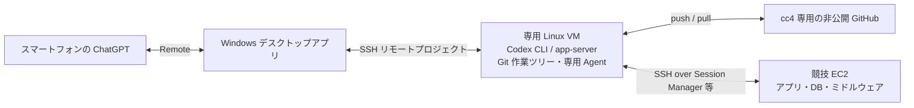

# ChallengeClub4（cc4）: Codex による ISUCON2026 自動化計画

更新: 2026-10-03 / 状態: 構成を検討済み、環境構築・動作確認はこれから

## 目的と活動の位置付け

企業の有志活動「技術チャレンジ部」の ISUCON メンバー7人で、Discord の定例会・練習と GitHub への TIPS 蓄積を進めている。
cc4 は ChallengeClub4 の略で、人間の参加者と Codex により、AI エージェント全自動でどこまで改善できるかを試す競技参加チーム。運営へのエントリーは済んでいる。AI は人間の登録選手を意味するものではない。

この文書は事前準備の設計・手順であり、環境構築や自動化が成功した記録ではない。大会当日のマニュアルと最新の公式資料を確認して更新する。

## 公開 TIPS と競技用リポジトリの分離

この isucon_tips は **公開リポジトリ**。ここには一般的な準備手順・公開可能な練習 TIPS を保存する。
競技中の問題コード、攻略情報、ベンチ結果、当日マニュアル、認証情報は保存しない。

本戦用に cc4 専用の **別の非公開 GitHub リポジトリ**を事前作成する。
アクセスは cc4 に必要な人・エージェントに限定し、他チームのメンバーには競技終了まで共有しない。
部活動の Discord にも本戦中の問題・改善内容を共有しない。定例会での合同練習と本戦での情報共有を区別する。
非公開であってもアクセス範囲に注意する。秘密鍵、AWS/Codex の認証トークン、パスワードは Git に入れない。

## 採用する構成



| 場所 | 役割 |
|---|---|
| スマートフォン | チャット、進捗、差分、承認・質問、通知の確認 |
| Windows | Remote の接続窓口、Linux VM の SSH リモートプロジェクトを表示 |
| 専用 Linux VM | Codex の実行、コード検索・修正、Git、テスト、配備、実験記録 |
| 非公開 GitHub | 履歴の保存、差分・実験結果の観測、復旧用コピー |
| 競技 EC2 | サービス実行、実環境の調査、公式ベンチでの性能検証 |

専用 VM にコードを置き、検索・編集を通常のローカルファイル操作として行う。
競技 EC2 は実際のログ、DB、設定、性能を調べる場所。VM のテストだけで性能改善を判断しない。
Codex の作業負荷・認証情報・履歴を競技サーバーから分離し、EC2 の再起動に備える。
外部 VM は開発・モニタリング用とし、採点対象の Web サービスの処理は許可された競技サーバー内で完結させる。

### Windows と Linux の Codex 接続

- Windows の「設定 → 接続 → この PC を操作」でスマートフォンをペアリングする。
- 同じ画面の「SSH」で Linux VM とそのプロジェクトフォルダーを登録する。
- スマートフォンは Windows ホストに接続し、そのホストが接続するリモート開発環境の作業を扱う構成が公式に説明されている。
- Linux VM は **Codex CLI** をインストール・認証する。Windows アプリが SSH 経由でリモート app-server を起動する。
- SSH のログインシェルから codex が PATH 上で見つかる必要がある。Linux の GUI は不要。
- Linux デスクトップアプリもプレビューとして存在するが、今回のヘッドレス VM には不要。
- Windows の電源・通信・アプリを維持し、スリープを防ぐ。スマートフォンからの一覧・通知・承認・再接続を実機検証する。
- Windows が切断されたときの実行継続・復旧は、使用バージョンで実験して確認する。CLI の実験的 remote-control を本番の前提にはしない。

## 認証と権限の分離

接続ごとに認証を分ける。

| 接続 | 認証・権限 |
|---|---|
| スマートフォン → Windows | 同一 ChatGPT アカウント・ワークスペース、デバイスのペアリング |
| Windows → Linux VM | VM 専用の SSH 鍵と Linux ユーザー |
| Linux VM → Codex サービス | VM 上で ChatGPT アカウントにログイン |
| Linux VM → GitHub | cc4 の非公開リポジトリに限定した資格情報 |
| Linux VM → 競技 EC2 | 競技用 SSH 鍵・専用 Agent、必要な OS 権限 |
| Linux VM → AWS Session Manager | 対象 EC2・SSM document 等に範囲を絞った IAM 権限 |

個人用 Pageant や既存の全鍵を共有せず、VM に競技用の Agent を用意する。
秘密鍵は VM の保護された場所に置き、人間が Agent に登録する。チャットや Git に渡さない。
Agent にアクセスできるプロセスは登録鍵で認証を試せるため、Agent は秘密鍵の読み取り防止だけでなく、登録鍵の分離と利用可能時間を管理する。
Agent forwarding は基本的に無効にする。接続先のホスト鍵は信頼できる経路で確認する。

専用ユーザー、対象ディレクトリへの権限、必要な sudo 操作を設定する。
競技ではサービス再起動や DB 設定変更が必要になるので、読み取り専用から始めた後、練習で必要な権限を洗い出す。
鍵の分離は接続先を、OS の権限はログイン後の操作を制限する。

## EC2 接続: Session Manager を第一候補として検証

通常の Session Manager シェルは SSH 鍵や EC2 のインバウンド22番開放を必要としない。
Codex の配備・ファイル転送には **Session Manager 経由の SSH** を第一候補として練習する。
これは通信経路が SSM になるだけで、EC2 上の sshd、ログインユーザー、SSH ユーザー鍵・ホスト鍵の確認は必要。

### 必要な設定

1. EC2 に SSM Agent を導入・起動する。指定 AMI に入っているとは仮定しない。
2. EC2 に AmazonSSMManagedInstanceCore 等の必要な権限を持つ IAM ロールをインスタンスプロファイルとして付ける。
3. EC2 から Systems Manager のエンドポイントへ HTTPS/443 で到達可能にする。
4. 操作側にもセッション開始・終了等の IAM 権限を付ける。EC2 用ロールとは別。
5. 開発 VM に AWS CLI と Session Manager plugin を入れ、AWS 認証・リージョンを設定する。
6. SSH トンネル用の AWS-StartSSHSession document の利用権限を確認する。

主要エンドポイントは ssm と ssmmessages。Agent・リージョンによって ec2messages も確認する。
インターネット経路を使わない場合は VPC Interface Endpoint と DNS・セキュリティグループを設定する。
通常の Session Manager は既定で管理権限を持つ ssm-user を使うため、必要に応じて Run As や権限を見直す。

Linux VM の SSH 設定例（値は当日に置き換える）:

```sshconfig
Host cc4-competition
    HostName i-REPLACE_WITH_INSTANCE_ID
    User REPLACE_WITH_OS_USER
    IdentityFile ~/.ssh/id_ed25519_cc4
    IdentitiesOnly yes
    ForwardAgent no
    StrictHostKeyChecking yes
    ProxyCommand aws ssm start-session --target %h --document-name AWS-StartSSHSession --parameters portNumber=%p --region REPLACE_WITH_REGION
```

公開鍵・ホスト鍵の登録を済ませた上で、SSH、SCP、非対話コマンドを確認する。
通常の SSM シェルを復旧用に残す。SSM が使えない場合の接続経路も練習する。
SSH over SSM のコマンド内容は通常の Session Manager セッションログでは記録できないため、配備・実験ログを別途保存する。

## 事前準備チェックリスト

### 専用 Linux VM

- [ ] 専用ユーザー、OS 更新、時刻同期、ディスク容量、バックアップを確認。
- [ ] Git、SSH、rg、ビルド・計測に必要なツールを導入。
- [ ] Codex CLI を公式手順で導入し、バージョンを記録。
- [ ] ChatGPT 認証を完了。ヘッドレス環境では codex login --device-auth を検証。
- [ ] SSH のログインシェルで codex --version と codex login status が成功。
- [ ] 競技用 Agent と鍵、GitHub 用の限定資格情報を用意。
- [ ] AWS CLI、Session Manager plugin、対象を限定した AWS 権限を検証。
- [ ] 認証の期限切れ・更新、Codex の利用上限と当日の余裕を確認。

### Windows とスマートフォン

- [ ] Windows から VM に手動 SSH 接続できる。
- [ ] Windows の SSH 設定に具体的な Host エイリアスを追加。
- [ ] アプリの「SSH」で VM の練習プロジェクトを登録。
- [ ] 「この PC を操作」でスマートフォンをペアリング。
- [ ] スマートフォンから VM 上のチャット、差分、通知、承認、追加指示を確認。
- [ ] スリープ・通信切断・アプリ再起動後の復旧を練習。
- [ ] 予備としてスマートフォン等から VM への SSH と履歴・ログの確認経路を確保。

### Git と自動化の練習

- [ ] cc4 専用の非公開リポジトリを作成し、アクセス範囲を確認。
- [ ] VM から clone/push を検証。公開 TIPS と URL を取り違えない。
- [ ] 初期状態の保存、コミット指定配備、結果保存、復元を過去問で一周実行。
- [ ] 認証ファイル、.env、DB ダンプ、巨大ログ、バイナリを Git の対象から除外。
- [ ] app、Nginx、systemd、DB 変更等の管理範囲と適用順を決める。
- [ ] VM と EC2 の CPU アーキテクチャ・ランタイム差を確認。ビルド場所を決める。
- [ ] ベンチの重複防止、配備ロック、タイムアウト、失敗時の復旧を実装・検証。
- [ ] 再起動後の正常動作・データ永続性を検証。
- [ ] 最新の公式ルールを確認し、当日マニュアルを取り込む手順を用意。

## Git と配備の運用

VM の作業ツリーを変更の中心にし、GitHub を履歴保存・観測先にする。
競技 EC2 に GitHub の書き込み資格情報は置かない。
EC2 から直接 pull する方式を選ぶなら、そのリポジトリだけを読む Deploy Key 等を検討する。
GitHub を経由せず VM から EC2 に配備できる経路を用意し、GitHub の一時障害で作業が止まらないようにする。

当日の初期コードに .git があれば既存履歴を引き継ぎ、なければ VM 上でリポジトリ化する。
EC2 上で git init して取得する方式でもよいが、EC2 → GitHub の直接 push は必須ではない。
初期コードの取得時には所有権、権限、シンボリックリンク、秘密情報を確認し、無差別に git add しない。

非公開リポジトリ内の推奨構成（当日の実装に合わせて調整）:

```text
app/                 アプリのコード
infra/               Nginx・systemd 等の設定テンプレート
db/                  スキーマ変更・適用と復元手順
scripts/             計測・配備・状態確認・復元
experiments/         実験ごとの小さな結果・分析
deployments/         EC2 ごとの配備コミットと設定版
STATUS.md            現在の方針・最新/最高スコア・次の作業
AGENTS.md            当日ルール、権限、停止条件、実行手順
```

大きなログ・プロファイル・DB バックアップは別の保護された保存場所に置き、Git には参照と要約を残す。
最初は小さなコミット中心でよく、改善ごとの PR を必須にしない。
複数案を並行検討する場合は branch/worktree を分け、配備と公式ベンチを操作する担当は一つにする。

## 当日の手順

公式日程は 2026-10-31 10:00–18:00 JST。最新情報・当日マニュアルを優先する。

### 1. ルールと環境を確認

- 当日マニュアルを読み、禁止事項、ベンチ方法、サーバー台数、初期化・再起動条件を非公開の作業指示に反映。
- 自チームの AWS アカウントで指定 AMI・指定方法に従って競技 EC2 を起動。
- インスタンス ID、リージョン、OS ユーザー、サービス構成を非公開の記録に保存。
- SSM/SSH 接続と必要権限を確認。AWS 基盤変更とアプリ改善の権限を分ける。
- Discord の運営アナウンスとポータルを人間が確認できる状態にする。

### 2. 初期状態を保存

- ソース、サービス設定、DB の状態を調査し、必要なバックアップと復元手順を作る。
- 初期コード・管理する設定を VM に取得し、Git 履歴と初期コミットを保存。
- 秘密情報が含まれないことを確認し、cc4 の非公開リポジトリへ push。
- 変更前の公式ベンチを実行し、基準スコア・ログ・計測条件を記録。

### 3. 自動改善の一周を開始

1. ログ・プロファイル・DB クエリ等からボトルネックを特定。
2. 仮説と期待する効果を記録。
3. VM で修正、必要なテストを実行し、コミット。
4. 未コミットの差分が混ざらない形でそのコミットを EC2 に配備。
5. 公式ベンチを一つだけ実行し、結果を取得。
6. 正しさ、スコア、誤差、リソース使用量を比較して採用または復元。
7. 実験結果と STATUS.md を更新し、GitHub に保存。
8. 次の仮説へ進む。

記録項目: 実験 ID、時刻、コミット、対象 EC2、DB/設定版、変更理由、スコア、エラー、採否、復元方法。
ベンチを並行実行せず、DB 変更を含む復元は git revert だけでは完結しないことに注意する。

### 4. 終了前の検証

- 改善を止める時刻に余裕を持ち、既知の正常版を全対象サーバーに揃える。
- 再起動後にサービスが起動し、必要データが残り、初期化コマンドが正常に動くことを確認。
- 再起動後の公式ベンチと配備コミットを記録。
- 採点に必要な設定を維持し、不要な計測負荷を停止。
- 競技終了後の追試が終わるまで必要な EC2・データを維持し、撤去時期は運営指示に従う。

## 全自動化の範囲と観測

全自動化の目標は「計測→仮説→変更→検証→採用/復元」の反復。
アカウント認証、参加登録、運営との連絡、当日ルールの判断は人間が責任を持つ。
承認待ちで停止しないよう、練習中に必要な操作と許可範囲を確認する。
承認不要にすることと、AWS アカウント全体・個人の鍵を無制限に渡すことを混同しない。

事前に決める停止条件:

- 公式ベンチの正しさ検証に失敗し、正常版に戻せない。
- 接続・認証障害、利用上限、ディスク不足などで作業継続できない。
- 当日ルールとの適合が不明な操作が必要。
- 終了前の検証時刻に到達。
- 人間が停止を指示。

スマートフォンの Codex 接続は実行中の状態を見る入口、GitHub は保存された履歴を読む入口。
全自動化を評価するため、人間の介入時刻・理由、停止時間、使用モデル・バージョン、利用量も非公開で記録する。
この会話で公開されたホスト鍵による接続先確認は成功したが、既存の Pageant への接続は検証していない。
その Windows 上の実験と、これから構築する専用 VM の動作実績を混同しない。

## 未検証・当日確定する事項

- [ ] 専用 VM の OS・構成、リモートチャットの切断時の挙動。
- [ ] スマートフォンから SSH リモートプロジェクトへの操作・通知。
- [ ] 指定 AMI の SSM Agent と SSM/SSH の到達性。
- [ ] 配備方式（Git、アーカイブ、ファイル転送）とビルド場所。
- [ ] 公式ベンチの呼び出し・結果取得を自動化できる範囲。
- [ ] sudo、DB、AWS IAM の必要権限と停止条件。
- [ ] 競技用非公開リポジトリ名、保存先、アクセス範囲。
- [ ] Codex の利用上限を踏まえた8時間の継続計画。

## 公式資料

設定は使用するバージョンの公式資料で確認する。

- [ISUCON2026 レギュレーション](https://isucon.net/archives/59966826.html): AI 活用、外部開発環境、情報共有、再起動後の追試。当日マニュアルが優先。
- [Codex Remote・SSH 接続](https://learn.chatgpt.com/docs/remote-connections): Windows とスマートフォン、SSH リモートプロジェクト。
- [Codex 認証](https://learn.chatgpt.com/docs/auth): ChatGPT と device code ログイン。
- [Codex CLI コマンド](https://learn.chatgpt.com/docs/developer-commands): CLI と app-server。
- [Linux デスクトップアプリ](https://learn.chatgpt.com/docs/linux/linux-app): GUI を使う場合の選択肢。
- [Session Manager 前提条件](https://docs.aws.amazon.com/systems-manager/latest/userguide/session-manager-prerequisites.html)
- [Session Manager 構築](https://docs.aws.amazon.com/systems-manager/latest/userguide/session-manager-getting-started.html)
- [SSM のネットワーク・VPC Endpoint](https://docs.aws.amazon.com/systems-manager/latest/userguide/setup-create-vpc.html)
- [Session Manager 経由の SSH](https://docs.aws.amazon.com/systems-manager/latest/userguide/session-manager-getting-started-enable-ssh-connections.html)
- [GitHub Deploy Key](https://docs.github.com/en/authentication/connecting-to-github-with-ssh/managing-deploy-keys)
